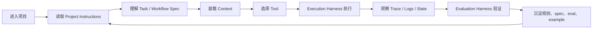

# Agent Project Infrastructure

> 本文研究一个问题：如何给项目和其中的 AI Agent 设计规则、边界、上下文、执行环境和评测标准，让 Agent 能稳定、可控、可复盘地工作？

## 结论

Agent 的表现不只取决于模型、提示词或工具数量，更取决于项目是否提供了足够清晰的基础设施。

我们将这套基础设施称为 **Agent Project Infrastructure**。它由六类能力组成：

| 分类 | 核心问题 | 典型载体 |
|---|---|---|
| Project Instructions | Agent 进入项目后先读什么，哪些规则具有约束力？ | `AGENTS.md`、目录级规则、团队协作约定 |
| Task / Workflow Spec | 模糊需求如何变成可执行、可验收的任务？ | spec、workflow、graph、DSL、任务模板 |
| Execution Harness | Agent 如何在可重复环境里执行、观察、修正？ | sandbox、runner、patch loop、命令封装、日志 |
| Evaluation Harness | 如何判断 Agent 真的做对，而不是看起来做对？ | trace、dataset、rubric、grader、benchmark |
| Tool Boundary & Permission Model | Agent 能调用什么，副作用如何授权和审计？ | tool schema、resource、approval、secret、policy |
| Context Architecture | Agent 如何获得刚好够用的上下文？ | repo map、microagent、memory、checkpoint、trace |

这六类不是资料目录，而是一条工作链路：规则定义行为边界，spec 定义任务目标，context 决定理解质量，tool boundary 限制行动范围，execution harness 提供反馈循环，evaluation harness 将经验沉淀成可回归的标准。

本文不是逐项目平均拆解。我们只挑出和这六类基础设施强相关、能形成工程启发的设计片段。

## 为什么第一篇写它

Agent Grove 后续会继续学习 prompt、RAG、多 Agent、长记忆、工作流编排和产品化，但这些都不能作为第一层地基。

如果项目没有清楚的 instructions，Agent 不知道哪些规则优先；如果没有 spec，Agent 只能围绕自然语言猜测任务边界；如果没有 harness，执行过程不可复现；如果没有 eval，结果只能靠主观感觉判断；如果没有 tool boundary，越强的 Agent 风险越高；如果没有 context architecture，大项目里的 Agent 很容易读错位置、遗漏约束或浪费窗口。

所以第一篇先写它：不是为了抽象地谈 Agent，而是先回答“一个项目怎样对 Agent 友好”。

## 研究样本

源码统一阅读自本地 `external/`，该目录不入库。

| 对象 | 来源 | 版本或日期 | 关注点 |
|---|---|---|---|
| AGENTS.md | <https://agents.md/> | 2026-05-04 阅读 | 项目规则入口、分层规则 |
| OpenAI Harness Engineering | <https://openai.com/index/harness-engineering/> | 2025-06-12 | harness、真实任务、反馈闭环 |
| OpenAI Agent Evals / Evals | OpenAI Developers | 2026-05-04 阅读 | trace、grader、dataset、eval run |
| Anthropic Building Effective Agents | Anthropic Engineering | 2024-12-19 | workflow / agent 区分、工具设计 |
| Anthropic Demystifying Evals | Anthropic Engineering | 2025-05-22 | agent harness 与 evaluation harness |
| MCP Specification | <https://modelcontextprotocol.io/specification/draft> | 2026-05-04 阅读 | host/client/server、tool/resource/prompt 边界 |
| OpenClaw | <https://github.com/openclaw/openclaw> | `e8d0cf75ea0e6c0db5a1468cb0715746fa3ad75e` | instructions、工具边界、QA scenario |
| Hermes Agent | <https://github.com/NousResearch/hermes-agent> | `8163d371922768c32f43eb6036d7d36e56775605` | 多渠道入口、memory、approval、runtime |
| OpenHands | <https://github.com/OpenHands/OpenHands> | `d3864d9992c4a7503b32e9fbc1fba8c4bf2bdf92` | sandbox、microagent、settings |
| SWE-agent | <https://github.com/SWE-agent/SWE-agent> | `0f4f3bba990e01ca8460b9963abdcd89e38042f2` | config spec、environment、tool filter、trajectory |
| Aider | <https://github.com/Aider-AI/aider> | `3ec8ec5a7d695b08a6c24fe6c0c235c8f87df9af` | repo map、git loop、lint/test、benchmark |
| Langfuse | <https://github.com/langfuse/langfuse> | `0256db00672babdeac527221186429ef258848ca` | trace、dataset、score、agent config |
| Ragas | <https://github.com/explodinggradients/ragas> | `298b68274234c060deacab3cf5fb52aa3a20e885` | metric、sample schema、tool call eval |
| Dify | <https://github.com/langgenius/dify> | `cd9daef564369b3926ce7fed242a1feb5c4a451f` | workflow DSL、graph runtime、tool adapter |
| LangGraph | <https://github.com/langchain-ai/langgraph> | `a0c4bdc3cb88e371a0fee00b6479509e9c9a8a72` | state graph、checkpoint、runtime context |

## 生命周期模型

一个 Agent 在项目中完成任务，通常会经历下面的链路：



这条链路解释了为什么单独优化 prompt 往往不够。Agent 的失败可能不是“模型不聪明”，而是项目没有告诉它边界、没有暴露正确上下文、没有提供可重复执行环境，或没有把失败转化为 eval。

## 项目切片观察

下面的切片不是完整架构解读，而是挑选最能说明 Agent Project Infrastructure 的实现。片段会尽量短，只保留能产生直观印象的结构。

### OpenClaw：`AGENTS.md` 像一个项目操作系统入口

OpenClaw 最值得学的不是“它也有 `AGENTS.md`”，而是它把 `AGENTS.md` 写成了项目级控制面。

它的根 `AGENTS.md` 同时承担五件事：

- 告诉 Agent 先读哪些 scoped guide。
- 给出源码地图，区分 core、plugin、SDK、channel、gateway、docs。
- 规定架构边界，例如 core 不应感知具体 extension id。
- 统一命令入口，例如使用 repo wrapper，不直接调用底层测试工具。
- 定义验证 gates、CI/PR 行为、安全限制和提交流程。

可以把它理解成下面这种结构：

```text
AGENTS.md
├─ Start: 进入仓库后的第一组动作
├─ Map: 目录和所有权地图
├─ Architecture: 可改与不可越界的边界
├─ Commands: 可信命令入口
├─ Gates: 什么修改需要什么验证
├─ GitHub / CI: PR、issue、CI 交互规则
├─ Code / Tests: 代码风格和测试约束
└─ Security / Release: 高风险操作边界
```

这比“请遵守项目规范”有效得多。Agent 不需要猜“我该运行什么命令”“这个模块归谁管”“能不能直接改 core”，这些都被项目入口显式建模。

OpenClaw 还有一个更有意思的点：它把 QA scenario 也纳入 harness。`qa/frontier-harness-plan.md` 关注的不是普通单元测试，而是 Agent 行为是否稳定：

| Scenario | 真正要测的能力 |
|---|---|
| `approval-turn-tool-followthrough` | 用户批准后，Agent 是否真的继续调用工具，而不是口头答应 |
| `model-switch-tool-continuity` | 切换模型后，工具能力和上下文是否还连续 |
| `source-docs-discovery-report` | Agent 是否能先读源码/文档，再给出具体报告 |
| `compaction-retry-mutating-tool` | 上下文压缩后，带副作用的操作是否仍保持可复盘 |

这很像一个成熟团队会做的 Agent 回归测试：不是只测 API，而是测“行为承诺是否兑现”。

对应基础设施：Project Instructions、Execution Harness、Evaluation Harness、Tool Boundary。

### SWE-agent：把 prompt、spec、harness 和 tool boundary 放进同一条 loop

SWE-agent 的亮点是它把 coding agent 的工作方式高度配置化。`config/default.yaml` 不是普通 prompt 文件，而是一份可版本化的任务契约。

节选式结构如下：

```yaml
agent:
  templates:
    system_template: "You are a helpful assistant..."
    instance_template: |
      <uploaded_files>{{working_dir}}</uploaded_files>
      <pr_description>{{problem_statement}}</pr_description>
      Make minimal changes to non-test files.
      1. Read relevant code
      2. Create a reproduction script
      3. Edit source code
      4. Rerun the reproduction script
      5. Think about edge cases
  tools:
    bundles:
      - tools/registry
      - tools/edit_anthropic
      - tools/review_on_submit_m
    enable_bash_tool: true
    parse_function:
      type: function_calling
```

这里有三个细节很值得注意。

第一，任务模板不是泛泛地说“帮我修 bug”，而是把工作流写死：先读代码、写复现、再修、再跑复现、考虑边界。这个模板就是 Task Spec。

第二，`ToolHandler` 的职责不是简单转发工具调用，而是负责安装工具、解析命令、多行命令处理、判断 action 是否被阻止、获取环境状态。也就是说，工具层本身就是一个边界系统。

第三，agent loop 会处理格式错误、被阻止的 action、bash 语法错误、超时、上下文超限、成本超限，并把运行过程写入 trajectory。它不是“一次模型调用”，而是一个能失败、重试、退出、记录的执行系统。

抽象成 Agent Grove 的语言，SWE-agent 给出的是这条链：

```text
task template -> model action -> parser -> tool filter -> environment -> observation -> history -> trajectory
```

对应基础设施：Task / Workflow Spec、Execution Harness、Tool Boundary & Permission Model、Evaluation Harness。

### Aider：repo map 是 coding agent 的上下文压缩器

Aider 的代表性亮点是 repo map。很多人会把它理解为“代码库索引”，但更准确地说，它是一个面向 LLM token budget 的上下文压缩器。

`aider/repomap.py` 里的 `RepoMap` 关注这些输入：

```python
RepoMap(
    map_tokens=1024,
    max_context_window=...,
    map_mul_no_files=8,
    refresh="auto",
)

get_repo_map(
    chat_files,
    other_files,
    mentioned_fnames,
    mentioned_idents,
)
```

这说明它不是把整个仓库塞给模型，而是根据当前聊天文件、其他文件、被提到的文件名和标识符，生成一份受 token 预算约束的代码地图。它还用 `.aider.tags.cache.v*` 缓存 tree-sitter / AST tag，避免每轮都重新扫完整仓库。

这就是 Repository Knowledge 的典型实现：不是 RAG 产品，不是向量库，而是“让模型用有限上下文看见代码结构”。

Aider 的另一个亮点是把编辑放进 git / lint / test loop：

- 修改前后能看 diff。
- 可以自动 lint/test。
- 可以在修复 lint/test 问题后继续让模型改。
- benchmark 在 Docker 中执行 LLM 生成代码，并记录 pass rate、malformed response、syntax error、context exhausted、cost、commit hash。

它的 benchmark 报告字段很工程化：

```yaml
pass_rate_1: ...
percent_cases_well_formed: ...
num_malformed_responses: ...
syntax_errors: ...
exhausted_context_windows: ...
commit_hash: ...
total_cost: ...
```

这里的启发是：coding agent 的质量不只看“能不能改对”，还要看输出格式、上下文耗尽率、成本、可复现版本。

对应基础设施：Context Architecture、Execution Harness、Evaluation Harness。

### Langfuse：eval 不是一个脚本，而是一套 trace / dataset / score 产品系统

Langfuse 有两个值得单独拎出来的设计。

第一个是 `.agents/`。它没有把 Agent 规则散落在 `.claude`、`.codex`、`.cursor`、`.vscode` 里，而是把 `.agents/` 作为 repo-owned source of truth，再生成不同工具需要的 shim。

它的共享配置形态类似：

```json
{
  "shared": {
    "setupScript": "bash scripts/codex/setup.sh",
    "devCommand": "pnpm run dev"
  },
  "mcpServers": {
    "playwright": { "transport": "stdio", "command": "npx" },
    "datadog": { "transport": "http", "url": "..." }
  },
  "codex": {
    "environment": { "version": 1, "name": "langfuse" }
  }
}
```

这个设计回答了一个现实问题：社区里会同时使用多种 Agent 工具，如果每个工具都有自己的私有规则目录，项目规则会很快分裂。Langfuse 的选择是：项目拥有规则，工具只是消费规则。

第二个亮点是 eval 产品化。Langfuse 的 ingestion 不是只接收“最终回答”，而是围绕这些实体展开：

```text
trace
observation
score
dataset_run_item
```

在 `worker/src/services/IngestionService/index.ts` 中，事件会被拆到不同处理流里：trace 进入 trace 记录，observation 进入观测记录，score 进入评分记录，dataset run item 会关联 dataset、item、trace、observation 和 expected output。

这说明生产级 eval 的核心不是“写个 judge prompt”，而是把一次 Agent 运行拆成可查询、可评分、可关联数据集的结构化事实。

对应基础设施：Project Instructions、Evaluation Harness、Context Architecture。

### OpenHands：把 agent 能力开关、sandbox 和 microagent 放进运行配置

OpenHands 的亮点是配置面很清楚。`config.template.toml` 里，Agent 能力不是藏在 prompt 里，而是显式开关：

```toml
[agent]
enable_browsing = true
enable_editor = true
enable_jupyter = true
enable_cmd = true
enable_think = true
enable_finish = true
enable_history_truncation = true

[sandbox]
base_container_image = "..."
enable_auto_lint = false
volumes = "host_path:container_path:rw"

[security]
confirmation_mode = false
security_analyzer = "llm"
enable_security_analyzer = true
```

这比“在 prompt 里告诉模型能做什么”更可靠。能力被建模成配置，配置再约束 runtime。

OpenHands 的 microagent 也值得注意：它用带 frontmatter trigger 的 Markdown 表达专项上下文。没有 trigger 的 microagent 总是加载，有 trigger 的只在用户消息命中时加载。这样可以避免把所有项目知识都塞进全局 prompt。

它的 sandbox README 也明确了运行边界：Agent 可能伤害系统，因此默认应该在 Docker 等 sandbox 里执行，并由 SandboxService / DockerSandboxService / SandboxSpecService / SandboxRouter 负责生命周期和访问控制。

对应基础设施：Execution Harness、Tool Boundary & Permission Model、Context Architecture。

### Hermes Agent：personal agent 的基础设施重点在多渠道、会话和权限

Hermes Agent 和 SWE-agent、Aider 这类 coding agent 不太一样。它更像长期个人助理，所以它的基础设施重点从“修一个 repo”扩展到“多渠道、多会话、多工具、多记忆”。

它的开发指南直接点出了 load-bearing entry points：

```text
run_agent.py       -> AIAgent core conversation loop
model_tools.py     -> tool discovery and function call handling
toolsets.py        -> toolset definitions
hermes_state.py    -> SQLite SessionDB and FTS search
gateway/platforms  -> Telegram, Discord, Slack, email, Feishu...
tools/environments -> local, docker, ssh, modal, daytona...
```

`AIAgent` 构造参数里包含 model、provider、enabled/disabled toolsets、platform、session_id、save_trajectories、skip_context_files、skip_memory 等。这说明 personal agent 的 runtime context 不是一个对话历史就够了，而是包含平台、会话、工具集、预算、记忆策略和轨迹保存。

它的 `toolsets.py` 也很有代表性：核心工具列表被共享给 CLI 和 messaging platform，平台插件还能自动生成对应 toolset。工具能力不是一份静态 schema，而是按平台、插件和运行状态组合出来的。

最值得借鉴的是 command registry：slash command 在一个中心 registry 定义，再派生出 CLI、gateway、Telegram、Slack、autocomplete 和 help。多渠道 Agent 如果没有这种“命令单一来源”，很快会出现某个平台能用、另一个平台忘记更新的漂移。

对应基础设施：Tool Boundary & Permission Model、Runtime Context、Project Instructions。

### Ragas：Agent eval 需要评估工具调用序列

Ragas 最适合作为 eval 侧的补充证据。它的 `MultiTurnSample` 不只存 user/assistant 文本，还能存 `ToolMessage` 和 `reference_tool_calls`。

简化形态如下：

```python
class MultiTurnSample:
    user_input: list[HumanMessage | AIMessage | ToolMessage]
    reference_tool_calls: list[ToolCall] | None
    rubrics: dict[str, str] | None
```

`ToolCallAccuracy` 则把工具调用拆成两个维度：

- 调用顺序是否对齐。
- 参数是否匹配。

它还支持 strict order 和 flexible order。这个细节非常重要：有些任务要求工具顺序严格一致，有些任务允许并行或重排。Eval harness 如果没有这种任务语义，就会把正确行为误判为错误，或把危险行为误判为正确。

对应基础设施：Evaluation Harness。

### Dify：workflow DSL 是可运行的 spec，不是静态文档

Dify 的亮点在 workflow。它的应用逻辑不是只写在 prompt 里，而是通过 workflow graph、node、edge、变量池、GraphEngine 和 DSL import/export 表达。

`WorkflowEntry` 创建 GraphEngine 时，会装配运行时状态和多层约束：

```text
GraphEngine
├─ graph
├─ graph_runtime_state
├─ command_channel
├─ ExecutionLimitsLayer
├─ LLMQuotaLayer
└─ ObservabilityLayer
```

这说明 spec 可以直接进入运行时：graph 决定节点和边，runtime state 承载变量和执行上下文，layer 负责限流、配额、观测。

Dify 的 DSL export 还有一个很工程化的细节：导出时如果 `include_secret` 为 false，会移除 tool node、agent node、model config 里的 `credential_id`。这不是文档层面的安全提醒，而是序列化边界里的默认行为。

用 Agent Grove 的语言说，Dify 把 Task / Workflow Spec、Execution Harness、Tool Boundary 放进了同一个工作流系统。

对应基础设施：Task / Workflow Spec、Execution Harness、Tool Boundary & Permission Model。

### LangGraph：state graph 和 checkpoint 让 runtime context 可恢复

LangGraph 的核心价值不是“画图”，而是把 long-running agent 的状态流动变成可执行图。

`StateGraph` 明确区分：

- `state_schema`：图中的可变状态。
- `context_schema`：本次运行的上下文。
- node / edge：状态如何被处理和转移。
- `compile(checkpointer=...)`：把图变成可运行对象，并接入持久化。

checkpoint 文档里最有启发的是 `thread_id` 和 `checkpoint_id`：

```python
{"configurable": {"thread_id": "1"}}
{"configurable": {"thread_id": "1", "checkpoint_id": "..."}}
```

这意味着 runtime context 不必只存在于一次模型上下文窗口里。它可以被保存、恢复、分支，失败节点可以利用 pending writes 避免重跑已经成功的部分。

这对 Agent Grove 的启发是：Runtime Context 应该从一开始就和 Repository Knowledge 区分开。前者是运行状态，后者是项目知识；两者都进上下文，但生命周期完全不同。

对应基础设施：Task / Workflow Spec、Execution Harness、Context Architecture。

### OpenAI / Anthropic / MCP：官方资料给出的边界

官方资料对本文最重要的贡献不是术语，而是边界。

OpenAI Harness Engineering 强调 harness 是围绕模型的工作环境和反馈机制，不是单个脚本。OpenAI Agent Evals 强调先用 trace 调试单次行为，再把可重复问题沉淀为 dataset 和 eval run。

Anthropic 的 eval 文章明确区分 agent harness 与 evaluation harness；Building Effective Agents 则提醒不要一开始就堆复杂框架，很多问题用 workflow 就够了。

MCP 的 host / client / server 结构，以及 tool / resource / prompt 分工，帮助我们把“只读上下文”和“有副作用行动”分开建模。这直接影响 Tool Boundary 的设计。

对应基础设施：Execution Harness、Evaluation Harness、Tool Boundary & Permission Model。

## 从项目到框架

把上面的观察压缩成一张表：

| 项目 | 最值得学习的亮点 | 对应分类 |
|---|---|---|
| OpenClaw | 根 `AGENTS.md` 像项目控制面；QA scenario 测 Agent 行为承诺 | Instructions / Harness / Eval / Tool Boundary |
| SWE-agent | YAML 任务契约、tool handler、environment、trajectory loop | Spec / Execution Harness / Tool Boundary |
| Aider | repo map 用 token budget 压缩代码库；benchmark 记录可复现指标 | Context / Harness / Eval |
| Langfuse | `.agents/` 统一多工具规则；trace/dataset/score 产品化 | Instructions / Eval / Context |
| OpenHands | 能力开关、sandbox、security analyzer、microagent | Harness / Tool Boundary / Context |
| Hermes Agent | 多渠道 command registry、toolset 组合、SessionDB、memory isolation | Tool Boundary / Runtime Context |
| Ragas | multi-turn sample 与 tool-call accuracy | Eval |
| Dify | workflow graph + runtime layer + DSL secret stripping | Spec / Harness / Tool Boundary |
| LangGraph | StateGraph、checkpoint、thread、pending writes | Spec / Runtime Context |

## 六类基础设施

### 1. Project Instructions

Project Instructions 是 Agent 进入项目后的规则入口。它应该告诉 Agent：先读什么、哪些目录有额外规则、哪些命令可信、哪些行为需要审批、什么样的修改必须验证。

`AGENTS.md` 的价值在于它把“给 Agent 的项目规则”从 README、聊天记录和个人偏好里抽出来，变成一个稳定、可发现、可分层的入口。官方 AGENTS.md 约定也强调：README 面向人，`AGENTS.md` 面向 Agent；目录下可以有更近的 `AGENTS.md` 覆盖局部规则。

从 OpenClaw 和 Langfuse 可以看到两个方向：

- OpenClaw 把 `AGENTS.md` 写成项目操作系统入口，负责路由、命令、架构边界、gates 和安全。
- Langfuse 把 `.agents/` 作为 repo-owned source of truth，再生成工具私有配置，避免多 Agent 工具规则漂移。

工程判断：优秀的 Project Instructions 不追求长，而追求可执行。它应该像“项目操作系统的入口表”，而不是一篇百科。

### 2. Task / Workflow Spec

Spec 解决的是任务边界问题：做什么、不做什么、验收标准是什么、哪些输入输出必须稳定。

在 Agent 项目里，spec 不一定是 Markdown。它可以是：

- SWE-agent 的任务模板和 reviewer checklist。
- Dify 的 workflow graph 和 DSL。
- LangGraph 的 StateGraph。
- OpenAI Symphony 案例里的 `SPEC.md` / `WORKFLOW.md` 分层。

工程判断：prompt 是一次对话里的指令，spec 是项目可维护的任务契约。长期项目不能只靠 prompt 记忆。

### 3. Execution Harness

Execution Harness 是围绕模型的一整套工作环境，而不只是脚本。对 coding agent 来说，它至少包括依赖安装、沙箱、工作目录、命令入口、测试循环、日志、artifact、失败恢复、超时策略和 patch loop。

项目里的典型形态：

- SWE-agent：agent loop + environment + ToolHandler + trajectory。
- OpenHands：sandbox service + runtime settings + security analyzer。
- Aider：git diff + lint/test + auto-fix + benchmark Docker。
- OpenClaw：frontier harness scenario + model family sweep。
- Dify：GraphEngine + runtime state + execution limits layer。

工程判断：Execution Harness 的目标是让 Agent 可以安全失败、快速复现、持续修正。没有 harness 的 Agent 更像一次性脚本。

### 4. Evaluation Harness

Evaluation Harness 与 Execution Harness 必须分开看。前者负责“怎么跑”，后者负责“怎么判”。Anthropic 在 eval 文章中也明确区分 agent harness 和 evaluation harness，这一点与 OpenAI Evals 的 trace/dataset/grader 思路一致。

Agent eval 不应该只看最终文本是否好看。它至少可以评估：

- 是否完成用户目标。
- 是否调用了正确工具。
- 是否违反 instructions 或安全边界。
- 是否产生不必要副作用。
- 是否能在同一任务集上稳定回归。

项目里的典型形态：

- OpenAI Agent Evals：trace-first，再沉淀 dataset 和 eval run。
- Langfuse：trace、observation、score、dataset run item 形成产品级闭环。
- Ragas：multi-turn sample 和 tool-call accuracy 让工具调用可评分。
- Aider：benchmark 报告 pass rate、格式错误、语法错误、上下文耗尽、成本和 commit hash。
- OpenClaw：QA scenario 测 approval、模型切换、compaction 等 Agent 行为。

工程判断：没有 eval，项目就无法知道某个 prompt、工具或规则调整到底让 Agent 变好了还是只是换了一种失败方式。

### 5. Tool Boundary & Permission Model

Tool Boundary 不是简单列工具名，而是回答：哪些能力是只读上下文，哪些能力会产生副作用，哪些能力需要审批，哪些 secret 可以进入运行时，哪些操作必须被记录。

MCP 的 tool / resource / prompt 分工提供了一个有用的底层视角：resource 更像上下文，tool 更像行动能力。把只读数据建模成 tool，会放大权限面；把有副作用的 tool 当作普通函数，会低估风险。

项目里的典型形态：

- SWE-agent 的 ToolHandler 和 blocklist 约束 action。
- OpenHands 用 sandbox、confirmation mode、security analyzer 管控执行。
- Dify 在 DSL export 边界移除 credential id。
- Hermes Agent 按平台、插件、session 组合 toolset，并处理 approval。
- OpenClaw 把 channel allowlist、approval scenario、安全规则写进项目和 QA。

工程判断：Agent 越能干，越需要清楚的权限模型。否则“更强的自动化”会直接变成“更大的不可控副作用”。

### 6. Context Architecture

Context Architecture 需要拆成两个子层，但暂不拆成两个顶层分类：

- Repository Knowledge：项目里的稳定知识，例如目录结构、源码索引、局部规则、API 文档、架构图。
- Runtime Context：执行中的动态状态，例如对话历史、trace、tool result、memory、checkpoint、session。

项目里的典型形态：

- Aider 的 repo map 是 Repository Knowledge。
- OpenHands 的 microagent 是按需注入的项目知识。
- LangGraph 的 checkpoint/thread 是 Runtime Context。
- Hermes 的 SessionDB、FTS search、memory provider 是长期 personal agent context。
- Langfuse 的 trace/observation 同时服务运行复盘和 eval。

工程判断：大项目里的上下文架构不能靠“把所有资料塞进去”。好的上下文系统应该能路由、压缩、恢复、追踪和过期。

## 分类修正

最初的六类分类基本成立，但需要三处修正：

| 原分类 | 修正后 | 原因 |
|---|---|---|
| Spec | Task / Workflow Spec | 源码观察显示 spec 不一定是文档，也可能是 graph、DSL、template 或 benchmark instance。 |
| Harness | Execution Harness | 需要与 Evaluation Harness 明确区分。前者负责执行环境和反馈循环，后者负责判分和回归。 |
| Tool Boundary | Tool Boundary & Permission Model | 项目案例普遍把 tool schema、审批、secret、sandbox、审计放在一起处理。 |
| Context Architecture | Context Architecture，内部分 Repository Knowledge / Runtime Context | Aider、OpenHands 偏 repo knowledge；LangGraph、Hermes、Langfuse 偏 runtime context。二者相关但生命周期不同。 |

因此，Agent Grove 当前采用“六类顶层框架，内部细分关键子层”的方式，不急于扩成更多目录。目录结构要等 example 和文档成熟后再稳定下来。

## 最小 example 设计

第一批 example 不追求复杂产品形态，只验证这六类基础设施如何共同影响 Agent 表现。

建议设计一个小型 coding-agent maintenance example：

- 一个很小的业务模块，例如配置解析器、任务队列或规则引擎。
- 一份 `AGENTS.md`，只写入口规则、命令、验证要求和禁止事项。
- 一份任务 spec，包含目标、非目标、验收标准和可修改范围。
- 一个 execution harness，负责准备环境、运行失败用例、执行测试、收集日志。
- 一个 evaluation harness，至少包含固定 fixture、rubric 和 trace 检查点。
- 一个 tool boundary 配置，区分 read、write、shell、network、secret。
- 一个 context map，说明 Agent 应先读哪些文件，哪些信息只在失败时读取。

暂不纳入：

- RAG。
- 多 Agent 协作。
- 长期记忆。
- 云端部署。
- 复杂 UI。
- 自动发布。

这样做不是因为这些不重要，而是因为第一阶段要先验证基础链路。只有最小链路跑通后，复杂能力才有稳定承载面。

## 视觉表达建议

这篇文章适合两类图。

第一类是可维护的技术图，继续用 Mermaid 或表格表达，例如生命周期图、项目到分类映射、最小 example 组成。

第二类是传播用概念图，可以用 GPT image 2 生成。建议画面不要塞技术小字，而是表达“Agent 在项目基础设施中工作”的隐喻：中心是一个 Agent 工作台，周围六个模块分别是 Instructions、Spec、Harness、Eval、Tool Boundary、Context，底部有 trace/logs/dataset 的反馈流。技术细节仍留给正文。

## Arbor 当前定位

Arbor 是 Agent Grove 的第一个 Agent。现阶段它不是全能助理，也不是自动生产系统，而是一个 **研究维护型 Agent**。

它当前应该做：

- 维护资料和源码快照，记录 repo、commit、阅读日期和关注模块。
- 检查文档中的关键判断是否能追溯到官方资料或项目案例。
- 把成熟结论沉淀进简洁文档，而不是堆链接。
- 维护最小 example 的边界，避免过早引入 RAG、多 Agent、长期记忆等复杂度。
- 在 Agent Grove 自身迭代时，帮助发现 instructions、spec、harness、eval、tool boundary、context architecture 的缺口。

它当前不应该做：

- 自主扩大研究范围。
- 未经确认创建大量目录和模板。
- 把外部项目完整架构搬运进文档。
- 把个人学习目标写进面向社区的项目首页。

## 对后续学习路径的影响

这篇文章给后续知识框架定了一个顺序：

1. 先学习怎样让项目对 Agent 可读、可执行、可验证。
2. 再学习单点能力，例如 tool calling、workflow、eval、memory、tracing。
3. 然后基于最小 example 做可运行实践。
4. 最后再考虑复杂产品形态，例如多 Agent、RAG、长期记忆和平台化。

这个顺序的核心是：先建立工程边界，再扩大 Agent 能力。

## 参考资料

- [AGENTS.md](https://agents.md/)
- [OpenAI: Harness engineering](https://openai.com/index/harness-engineering/)
- [OpenAI: Unlocking the Codex harness](https://openai.com/index/unlocking-the-codex-harness/)
- [OpenAI: Open-source Codex orchestration with Symphony](https://openai.com/index/open-source-codex-orchestration-symphony/)
- [OpenAI Evals](https://developers.openai.com/api/docs/guides/evals)
- [OpenAI Agent Evals](https://developers.openai.com/api/docs/guides/agent-evals)
- [Anthropic: Building effective agents](https://www.anthropic.com/engineering/building-effective-agents)
- [Anthropic: Demystifying evals for AI agents](https://www.anthropic.com/engineering/demystifying-evals-for-ai-agents)
- [MCP Specification](https://modelcontextprotocol.io/specification/draft)
