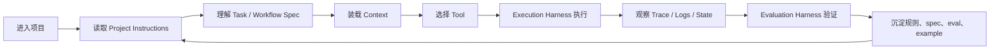

# Agent Project Infrastructure

> 本文研究一个问题：如何给项目和其中的 AI Agent 设计规则、边界、上下文、执行环境和评测标准，让 Agent 能稳定、可控、可复盘地工作？

## 结论

Agent 的表现不只取决于模型、提示词或工具数量，更取决于项目是否提供了足够清晰的基础设施。

我们将这套基础设施称为 **Agent Project Infrastructure**。基于官方资料和 9 个代表性项目的源码观察，当前最稳妥的顶层框架仍然是六类：

| 分类 | 核心问题 | 典型载体 |
|---|---|---|
| Project Instructions | Agent 进入项目后先读什么，哪些规则具有约束力？ | `AGENTS.md`、目录级规则、团队协作约定 |
| Task / Workflow Spec | 模糊需求如何变成可执行、可验收的任务？ | spec、workflow、graph、DSL、任务模板 |
| Execution Harness | Agent 如何在可重复环境里执行、观察、修正？ | sandbox、runner、patch loop、命令封装、日志 |
| Evaluation Harness | 如何判断 Agent 真的做对，而不是看起来做对？ | trace、dataset、rubric、grader、benchmark |
| Tool Boundary & Permission Model | Agent 能调用什么，副作用如何授权和审计？ | tool schema、resource、approval、secret、policy |
| Context Architecture | Agent 如何获得刚好够用的上下文？ | repo map、microagent、memory、checkpoint、trace |

这六类不是资料目录，而是一条工作链路：规则定义行为边界，spec 定义任务目标，context 决定理解质量，tool boundary 限制行动范围，execution harness 提供反馈循环，evaluation harness 将经验沉淀成可回归的标准。

本文不按项目平均拆解，也不把项目作为独立案例章节。所有项目都放进这六类基础设施中横向比较：有亮点的地方展开，重复或贡献较弱的地方简写，缺失或不明显的地方也明确说明。

## 为什么第一篇写它

Agent Grove 后续会继续学习 prompt、RAG、多 Agent、长记忆、工作流编排和产品化，但这些都不能作为第一层地基。

如果项目没有清楚的 instructions，Agent 不知道哪些规则优先；如果没有 spec，Agent 只能围绕自然语言猜测任务边界；如果没有 harness，执行过程不可复现；如果没有 eval，结果只能靠主观感觉判断；如果没有 tool boundary，越强的 Agent 风险越高；如果没有 context architecture，大项目里的 Agent 很容易读错位置、遗漏约束或浪费窗口。

所以第一篇先写它：不是为了抽象地谈 Agent，而是先回答“一个项目怎样对 Agent 友好”。

## 研究方法与样本

源码统一阅读自本地 `external/`，该目录不入库。本文只分析与 Agent Project Infrastructure 有关的文件、配置、prompt、运行链路和产品结构，不做完整架构拆解。

| 对象 | 来源 | 版本或日期 | 关注点 |
|---|---|---|---|
| AGENTS.md | <https://agents.md/> | 2026-05-04 阅读 | 项目规则入口、分层规则 |
| OpenAI Harness Engineering | <https://openai.com/index/harness-engineering/> | 2025-06-12 | harness、真实任务、反馈闭环 |
| OpenAI Agent Evals / Evals | OpenAI Developers | 2026-05-04 阅读 | trace、grader、dataset、eval run |
| Anthropic Building Effective Agents | Anthropic Engineering | 2024-12-19 | workflow / agent 区分、工具设计 |
| Anthropic Demystifying Evals | Anthropic Engineering | 2025-05-22 | agent harness 与 evaluation harness |
| MCP Specification | <https://modelcontextprotocol.io/specification/draft> | 2026-05-04 阅读 | host/client/server、tool/resource/prompt 边界 |
| OpenClaw | <https://github.com/openclaw/openclaw> | `e8d0cf75ea0e6c0db5a1468cb0715746fa3ad75e` | instructions、工具边界、QA scenario |
| Hermes Agent | <https://github.com/NousResearch/hermes-agent> | `8163d371922768c32f43eb6036d7d36e56775605` | 多渠道入口、memory、approval、runtime |
| OpenHands | <https://github.com/OpenHands/OpenHands> | `d3864d9992c4a7503b32e9fbc1fba8c4bf2bdf92` | sandbox、microagent、settings |
| SWE-agent | <https://github.com/SWE-agent/SWE-agent> | `0f4f3bba990e01ca8460b9963abdcd89e38042f2` | config spec、environment、tool filter、trajectory |
| Aider | <https://github.com/Aider-AI/aider> | `3ec8ec5a7d695b08a6c24fe6c0c235c8f87df9af` | repo map、git loop、lint/test、benchmark |
| Langfuse | <https://github.com/langfuse/langfuse> | `0256db00672babdeac527221186429ef258848ca` | trace、dataset、score、agent config |
| Ragas | <https://github.com/explodinggradients/ragas> | `298b68274234c060deacab3cf5fb52aa3a20e885` | metric、sample schema、tool call eval |
| Dify | <https://github.com/langgenius/dify> | `cd9daef564369b3926ce7fed242a1feb5c4a451f` | workflow DSL、graph runtime、tool adapter |
| LangGraph | <https://github.com/langchain-ai/langgraph> | `a0c4bdc3cb88e371a0fee00b6479509e9c9a8a72` | state graph、checkpoint、runtime context |

## 生命周期模型

一个 Agent 在项目中完成任务，通常会经历下面的链路：



这条链路解释了为什么单独优化 prompt 往往不够。Agent 的失败可能不是“模型不聪明”，而是项目没有告诉它边界、没有暴露正确上下文、没有提供可重复执行环境，或没有把失败转化为 eval。

## 全景矩阵

下表不是给项目打分，而是标注每个项目在六类基础设施上的可观察成熟度。

- **强**：有明确实现，且对本文主题有直接参考价值。
- **中**：有相关实现，但不是该项目最核心亮点，或实现依赖其他模块。
- **弱**：有痕迹，但不适合作为主要案例。
- **非重点**：本文未观察到足够强的项目内实现，或它不是该项目目标。

| 项目 | Instructions | Spec | Execution Harness | Evaluation Harness | Tool Boundary | Context Architecture |
|---|---|---|---|---|---|---|
| OpenClaw | 强 | 中 | 强 | 强 | 强 | 中 |
| Hermes Agent | 中 | 中 | 中 | 中 | 强 | 强 |
| OpenHands | 中 | 中 | 强 | 中 | 强 | 强 |
| SWE-agent | 弱 | 强 | 强 | 强 | 强 | 中 |
| Aider | 弱 | 中 | 强 | 强 | 中 | 强 |
| Langfuse | 强 | 中 | 中 | 强 | 中 | 强 |
| Ragas | 弱 | 中 | 弱 | 强 | 中 | 中 |
| Dify | 中 | 强 | 强 | 中 | 强 | 中 |
| LangGraph | 弱 | 强 | 强 | 中 | 弱 | 强 |

这个矩阵给出一个初步判断：行业已经在 **Execution Harness、Tool Boundary、Context Architecture、Evaluation Harness** 上形成强烈方向感，但 **Project Instructions** 和 **Task / Workflow Spec** 还没有统一形态。前者正在向 `AGENTS.md` / `.agents/` 靠拢，后者仍然在 Markdown、YAML、graph、DSL、dataset schema 之间分化。

## 六类基础设施横向分析

### 1. Project Instructions

Project Instructions 是 Agent 进入项目后的规则入口。它回答：先读什么、哪些规则优先、哪些命令可信、哪些边界不能越过、修改后必须如何验证。

#### 各项目表现

| 项目 | 实现情况 | 观察结论 |
|---|---|---|
| OpenClaw | 根 `AGENTS.md` + 多个 scoped `AGENTS.md` | 最成熟。根文档像项目控制面，覆盖目录地图、架构边界、命令、gates、CI、git、安全。 |
| Langfuse | `.agents/AGENTS.md` + `.agents/config.json` + provider shims | 很有启发。项目拥有规则，再生成 Claude、Codex、Cursor、VSCode 等工具需要的配置。 |
| OpenHands | 根 `AGENTS.md` + microagents | 根规则较长，microagents 用于按任务触发局部上下文。 |
| Hermes Agent | 根 `AGENTS.md` | 更像开发者导览，重点是 load-bearing entry points、命令注册、多渠道入口。 |
| Dify | 根 `AGENTS.md` + `api/AGENTS.md` | 规则偏工程协作和架构约束，强调 DDD、类型、tenant-aware。 |
| SWE-agent | 项目说明和配置为主 | 不是 instructions 的代表案例，更多约束沉淀在 config 和模板里。 |
| Aider | 用户文档和运行约定为主 | 不是 repo-level Agent instructions 的重点案例。 |
| Ragas | 文档和 examples 为主 | 不是项目规则入口的重点案例。 |
| LangGraph | `AGENTS.md` 偏 monorepo 开发规则 | 有贡献，但不如 OpenClaw / Langfuse 对 Agent 项目规则的启发强。 |

#### 典型实现

OpenClaw 的根 `AGENTS.md` 可以抽象成下面这种结构：

```text
AGENTS.md
├─ Start: 进入仓库后的第一组动作
├─ Map: 目录和所有权地图
├─ Architecture: 可改与不可越界的边界
├─ Commands: 可信命令入口
├─ Gates: 什么修改需要什么验证
├─ GitHub / CI: PR、issue、CI 交互规则
├─ Code / Tests: 代码风格和测试约束
└─ Security / Release: 高风险操作边界
```

Langfuse 的 `.agents/` 则代表另一种方向：规则源不绑定某一个 Agent 工具，而是由仓库拥有。

```json
{
  "shared": {
    "setupScript": "bash scripts/codex/setup.sh",
    "devCommand": "pnpm run dev"
  },
  "mcpServers": {
    "playwright": { "transport": "stdio", "command": "npx" },
    "datadog": { "transport": "http", "url": "..." }
  },
  "codex": {
    "environment": { "version": 1, "name": "langfuse" }
  }
}
```

这两个项目说明：成熟的 Project Instructions 不只是“开发规范”，而是 Agent 的项目入口、权限入口、上下文入口和验证入口。

#### 共性与分歧

共性已经出现：项目需要一个稳定、可发现、可版本化的 Agent 规则入口。`AGENTS.md` 是当前最明显的收敛方向。

分歧也很明显：OpenClaw 把大部分约束写进 `AGENTS.md`，Langfuse 用 `.agents/` 生成不同工具的 shim，OpenHands 则用 microagents 拆分局部提示。也就是说，行业还没有完全统一到一个文件格式。

#### 采用建议

自己的项目应采用两层结构：

- 根 `AGENTS.md`：只放全局入口、目录地图、命令、边界、验证要求。
- 局部规则或 skills：放特定目录、特定技术栈、特定任务的细节。

如果项目会同时被多个 Agent 工具使用，可以学习 Langfuse，把 `.agents/` 作为真实 source of truth，再生成工具私有配置。Agent Grove 当前可以先保持简单，不急于引入生成体系。

### 2. Task / Workflow Spec

Spec 解决的是任务边界问题：做什么、不做什么、验收标准是什么、输入输出如何稳定，哪些步骤可以由 Agent 自主决定，哪些必须按 workflow 执行。

#### 各项目表现

| 项目 | 实现情况 | 观察结论 |
|---|---|---|
| SWE-agent | `config/default.yaml` 的 system/instance template、tool bundle、review checklist | coding agent 里最清晰的任务契约案例。 |
| Dify | workflow graph、node、edge、DSL import/export | workflow platform 里最典型。spec 是可运行的业务图。 |
| LangGraph | `StateGraph`、state schema、context schema、node/edge、compile | 把 workflow spec 变成低层可编排图。 |
| OpenAI Symphony | `SPEC.md` / `WORKFLOW.md` 分层 | 官方案例证明 Markdown spec 仍然有价值，尤其适合协作和 orchestration。 |
| OpenHands | agent settings、microagents、runtime config | spec 分散在能力配置和 prompt extension 中。 |
| Hermes Agent | toolsets、command registry、platform/session 参数 | 更像 runtime capability spec，不是任务 spec 的纯粹案例。 |
| Aider | edit format、benchmark task、architect/editor 模式 | 有任务表达，但不是统一 workflow spec。 |
| Langfuse | dataset、evaluator config、agent setup | 更偏 eval spec 和 repo setup，不是执行 workflow 的主案例。 |
| Ragas | sample schema、rubrics、reference tool calls | eval 任务 spec 很强，业务 workflow spec 不是重点。 |
| OpenClaw | QA scenario、rules、gates | 更像行为 spec 和项目规则，不是业务 workflow spec。 |

#### 典型实现

SWE-agent 的默认配置不是简单 prompt，而是一份可版本化任务契约：

```yaml
agent:
  templates:
    instance_template: |
      <uploaded_files>{{working_dir}}</uploaded_files>
      <pr_description>{{problem_statement}}</pr_description>
      Make minimal changes to non-test files.
      1. Read relevant code
      2. Create a reproduction script
      3. Edit source code
      4. Rerun the reproduction script
      5. Think about edge cases
  tools:
    bundles:
      - tools/registry
      - tools/edit_anthropic
      - tools/review_on_submit_m
```

这个片段的重点不是文案，而是它把“修 bug 的工作法”写成模板：读代码、复现、修改、验证、考虑边界。Agent 不是凭感觉修，而是被一个任务契约牵引。

Dify 和 LangGraph 代表另一个方向：spec 不一定是文档，而是可运行结构。

```text
Dify workflow
├─ graph
├─ nodes
├─ edges
├─ variable_pool
└─ GraphEngine layers

LangGraph
├─ StateGraph(state_schema, context_schema)
├─ add_node / add_edge
└─ compile(checkpointer=...)
```

Ragas 则提醒我们：eval 本身也需要 spec。它的 `MultiTurnSample` 同时表达对话、工具消息、参考工具调用和 rubrics。

```python
class MultiTurnSample:
    user_input: list[HumanMessage | AIMessage | ToolMessage]
    reference_tool_calls: list[ToolCall] | None
    rubrics: dict[str, str] | None
```

#### 共性与分歧

共性是：成熟项目不会只依赖一次性自然语言需求。任务会被结构化为模板、配置、graph、dataset 或 workflow。

分歧是：spec 的形态高度依赖项目类型。

- Coding agent 偏 YAML template、benchmark instance、review checklist。
- Workflow platform 偏 graph / DSL。
- Eval framework 偏 dataset schema、rubric、reference output。
- 多渠道 personal agent 偏 toolset、session、platform capability。

#### 采用建议

自己的项目不应一开始追求复杂 DSL。建议采用递进策略：

1. 用 Markdown spec 表达目标、非目标、修改范围和验收标准。
2. 用小型 YAML/JSON manifest 表达可执行参数，例如入口命令、fixture、权限。
3. 当 workflow 稳定后，再考虑 graph / DSL。

Agent Grove 的第一个 example 应先使用 Markdown spec + 简单 harness 配置，不急于做图形 workflow。

### 3. Execution Harness

Execution Harness 是让 Agent 能在可重复环境里执行、观察、修正的系统。OpenAI 的 harness engineering 文章把 harness 视为模型周围的工具、环境和反馈机制，这与源码观察一致。

#### 各项目表现

| 项目 | 实现情况 | 观察结论 |
|---|---|---|
| SWE-agent | agent loop、environment、ToolHandler、trajectory | coding agent execution harness 的核心样本。 |
| OpenHands | sandbox service、runtime settings、confirmation/security config | sandbox 和 runtime 生命周期最清晰。 |
| Aider | git diff、lint/test、auto-fix、auto-commit、benchmark Docker | 本地开发 loop 很强。 |
| Dify | GraphEngine、runtime state、ExecutionLimitsLayer、LLMQuotaLayer、ObservabilityLayer | workflow runtime harness 很强。 |
| LangGraph | compiled graph、checkpoint、pending writes、thread | stateful execution harness 很强。 |
| OpenClaw | QA runner、frontier harness plan、Testbox gates | 行为级 harness 和验证 gate 很强。 |
| Hermes Agent | terminal environments、gateway、batch runner、trajectories | personal agent runtime 中等偏强。 |
| Langfuse | dev setup、workers、ingestion pipeline | 不是执行 Agent 的 harness，偏观测/eval 平台运行。 |
| Ragas | eval executor、experiment runner | 执行的是 eval，不是通用 Agent runtime。 |

#### 典型实现

SWE-agent 的执行链可以概括为：

```text
model action
  -> parser
  -> ToolHandler.should_block_action
  -> SWEEnv.execute
  -> observation
  -> history
  -> trajectory
```

这里的关键是：harness 不只是“能跑 shell”。它还要处理格式错误、被阻止的 action、bash 语法错误、timeout、上下文超限、成本超限和退出状态。

OpenHands 把运行能力显式配置化：

```toml
[agent]
enable_browsing = true
enable_editor = true
enable_jupyter = true
enable_cmd = true
enable_history_truncation = true

[sandbox]
base_container_image = "..."
enable_auto_lint = false
volumes = "host_path:container_path:rw"

[security]
confirmation_mode = false
security_analyzer = "llm"
enable_security_analyzer = true
```

Dify 的 workflow runtime 展示了平台型 harness：

```text
GraphEngine
├─ graph
├─ graph_runtime_state
├─ command_channel
├─ ExecutionLimitsLayer
├─ LLMQuotaLayer
└─ ObservabilityLayer
```

LangGraph 的 checkpoint 则处理长运行任务的恢复问题：`thread_id` 标识一条执行线，`checkpoint_id` 可以从中间状态恢复，pending writes 避免失败后重跑已成功节点。

#### 共性与分歧

共性很强：成熟项目都会把执行放进 loop，而不是一次模型调用。loop 至少包括 action、execution、observation、retry 或 record。

分歧在于运行对象不同：

- Coding agent 的 harness 聚焦 repo、patch、test、shell。
- Workflow platform 的 harness 聚焦 graph、state、limits、quota。
- Personal agent 的 harness 聚焦 channel、session、approval、environment。
- Eval platform 的 harness 聚焦批量运行、数据集、score。

#### 采用建议

自己的项目至少应具备：

- 一个稳定入口命令，例如 `run task` 或 `run eval`。
- 一个隔离执行环境，本地可以先用临时目录，后续再加 Docker。
- 一份结构化运行日志，至少记录 task id、输入、工具调用、输出、错误。
- 明确的 timeout、retry、失败退出语义。

不要一开始就做复杂平台。先把单任务可重复跑通。

### 4. Evaluation Harness

Evaluation Harness 负责“怎么判”，Execution Harness 负责“怎么跑”。Anthropic 明确区分 agent harness 和 evaluation harness，OpenAI Evals 也把 eval 建模为 dataset、grader、run 和 result。

#### 各项目表现

| 项目 | 实现情况 | 观察结论 |
|---|---|---|
| OpenAI Evals / Agent Evals | trace、dataset、grader、eval run | 官方方向明确：先 trace，再沉淀可重复 eval。 |
| Langfuse | trace、observation、score、dataset run item、evaluator config、annotation queue | 生产级 eval 产品化最完整。 |
| Ragas | sample schema、metric、rubric、tool-call accuracy | 评估工具调用序列的典型实现。 |
| Aider | benchmark harness、Docker、pass rate、格式/语法/上下文/成本指标 | coding agent benchmark 很实用。 |
| SWE-agent | trajectory、SWE-Bench evaluate hook、review submission | coding task 评测闭环明确。 |
| OpenClaw | QA scenario、frontier model sweep、approval/model-switch/compaction 行为检查 | 行为级 regression 很有启发。 |
| Dify | observability layer、workflow runtime data | 有观测基础，但本文未展开其完整 eval 产品链。 |
| LangGraph | 主要依赖 LangSmith 生态做 eval/observability | 项目本体不是 eval 的主样本。 |
| Hermes Agent | batch runner、trajectories、release notes 中的行为 benchmark | 有 eval 痕迹，但不是本文最强案例。 |
| OpenHands | BrowserGym eval env、测试和 sandbox 运行 | 有 eval 接口，但本次观察重点不是完整评测体系。 |

#### 典型实现

Langfuse 的 ingestion 说明生产 eval 不是只看最终回答，而是把一次运行拆成结构化实体：

```text
trace
observation
score
dataset_run_item
```

`dataset_run_item` 会关联 dataset、item、trace、observation 和 expected output。这样一次 Agent run 既可以被人复盘，也可以被自动评分，还能和数据集回归关联。

Ragas 的 `ToolCallAccuracy` 说明 Agent eval 需要看过程：

```text
predicted tool calls
reference tool calls
sequence alignment
argument accuracy
strict order / flexible order
```

Aider benchmark 则展示 coding agent 指标不只是一句 pass/fail：

```yaml
pass_rate_1: ...
percent_cases_well_formed: ...
num_malformed_responses: ...
syntax_errors: ...
exhausted_context_windows: ...
commit_hash: ...
total_cost: ...
```

OpenClaw 的 QA scenario 更偏行为承诺：

| Scenario | 真正要测的能力 |
|---|---|
| `approval-turn-tool-followthrough` | 用户批准后，Agent 是否真的继续调用工具 |
| `model-switch-tool-continuity` | 切换模型后，工具能力和上下文是否连续 |
| `source-docs-discovery-report` | Agent 是否先读源码/文档再报告 |
| `compaction-retry-mutating-tool` | 上下文压缩后，带副作用操作是否可复盘 |

#### 共性与分歧

共性正在形成：eval 必须同时看结果和过程。trace、tool call、dataset、score、rubric 是高频组成件。

分歧仍然较大：

- coding agent 偏 benchmark 和测试通过率。
- agent platform 偏 trace、score、annotation。
- workflow product 偏节点级观测和业务结果。
- personal agent 偏行为场景、approval、记忆与渠道连续性。

#### 采用建议

自己的项目建议采用三层 eval：

1. **Trace-first**：先记录每次运行的输入、工具调用、输出、错误和耗时。
2. **Fixture regression**：把稳定失败转成小数据集和固定检查。
3. **Rubric / grader**：对无法用断言覆盖的行为增加评分标准。

不要一开始追求“全自动 judge”。先保证失败可复盘、样本可回归。

### 5. Tool Boundary & Permission Model

Tool Boundary 不是列工具名，而是回答：哪些能力是只读上下文，哪些能力会产生副作用，哪些能力需要审批，哪些 secret 可以进入运行时，哪些操作必须被记录。

#### 各项目表现

| 项目 | 实现情况 | 观察结论 |
|---|---|---|
| SWE-agent | ToolHandler、blocklist、parser、timeout、bash syntax check | coding agent 的工具边界很清楚。 |
| OpenHands | sandbox、confirmation mode、security analyzer、secret 传递 | runtime 权限模型很强。 |
| Dify | tool node runtime、workflow-as-tool、DSL export secret stripping | 产品级工具边界和凭证边界很明确。 |
| Hermes Agent | toolsets、platform toolset、approval、session scope、memory isolation | 多渠道 personal agent 的权限模型代表案例。 |
| OpenClaw | channel allowlist、approval scenario、安全规则、gates | 工具边界与项目规则、QA scenario 结合紧密。 |
| Aider | shell confirmation、git diff、lint/test、benchmark Docker | 中等，重点是本地开发安全和可回退。 |
| Langfuse | MCP server config、agent shims、trace/eval 权限 | 有边界意识，但不是 tool runtime 的主样本。 |
| Ragas | reference tool calls、tool-call metric | 评估工具边界，不负责运行时权限。 |
| LangGraph | tool 边界通常由上层应用或 LangChain 组件实现 | 项目本体不是 permission model 的主案例。 |

#### 典型实现

MCP 的 tool / resource / prompt 分工提供了一个底层视角：resource 更像上下文，tool 更像行动能力。把只读数据建模成 tool，会放大权限面；把有副作用的 tool 当普通函数，会低估风险。

SWE-agent 的 ToolHandler 把工具调用放进多个检查点：

```text
parse action
  -> block interactive / unsafe commands
  -> syntax check
  -> timeout
  -> environment execution
  -> observation
```

Dify 在 DSL export 边界处理 secret：

```text
include_secret = false
  -> remove tool node credential_id
  -> remove agent node tool credential_id
  -> remove model config tool credential_id
```

Hermes Agent 则展示了 personal agent 的复杂性：工具集不是静态列表，而是按 CLI、Telegram、Discord、Slack、gateway、plugin、session 和配置组合。多平台 command registry 也必须保持单一来源，否则平台间能力会漂移。

#### 共性与分歧

共性很强：成熟项目都不再把 tool 当普通函数看待。tool schema 只是入口，真正重要的是 permission、approval、secret、sandbox、audit。

分歧在于权限粒度：

- coding agent 更关注 shell、文件、git、测试。
- personal agent 更关注平台、用户、会话、记忆、跨渠道发送。
- workflow platform 更关注凭证、节点、workflow-as-tool、tenant。
- eval framework 更关注“工具调用是否正确”，不直接控制权限。

#### 采用建议

自己的项目应先定义四级权限：

| 级别 | 能力 | 默认策略 |
|---|---|---|
| read | 读文件、读文档、读配置 | 默认允许，记录访问 |
| write | 修改工作区文件 | 允许但必须 diff 可见 |
| execute | shell、测试、脚本、外部进程 | 受 harness 控制，设置 timeout |
| external | 网络、凭证、消息发送、发布 | 默认需要审批 |

同时区分 resource 和 tool。只读上下文优先建模成 resource 或 context，不要为了统一接口全部做成 tool。

### 6. Context Architecture

Context Architecture 回答“Agent 应该知道什么，以及这些信息何时进入上下文”。源码观察后，这一类必须明确拆成两个子层：

- **Repository Knowledge**：稳定项目知识，例如目录结构、源码索引、局部规则、API 文档、架构图。
- **Runtime Context**：任务执行中的动态状态，例如对话历史、trace、tool result、memory、checkpoint、session。

暂时不把它们拆成两个顶层分类，因为实际项目常常把二者放在一条链路里使用。但文档和 example 里必须明确区分。

#### 各项目表现

| 项目 | 实现情况 | 观察结论 |
|---|---|---|
| Aider | repo map、tree-sitter tags、token budget、cache | Repository Knowledge 最典型。 |
| OpenHands | microagents、prompt extensions、history truncation、condenser | 项目知识和运行上下文都很明确。 |
| LangGraph | checkpoint、thread、state graph、pending writes | Runtime Context 最典型。 |
| Hermes Agent | SessionDB、FTS search、context compressor、memory provider、profile/session isolation | personal agent 长期上下文最典型。 |
| Langfuse | trace、observation、dataset run、score | 运行复盘上下文和 eval 上下文很强。 |
| Dify | VariablePool、GraphRuntimeState、workflow variables | workflow runtime context 明确。 |
| SWE-agent | history processors、trajectory、working dir、problem statement | coding task 上下文中等。 |
| OpenClaw | scoped `AGENTS.md`、docs list/read_when、memory QA scenario | 项目知识路由和行为场景有启发。 |
| Ragas | sample schema、run traces、multi-turn messages | eval context 明确，但不是项目知识系统。 |

#### 典型实现

Aider 的 repo map 很适合说明 Repository Knowledge：

```python
RepoMap(
    map_tokens=1024,
    max_context_window=...,
    map_mul_no_files=8,
    refresh="auto",
)

get_repo_map(
    chat_files,
    other_files,
    mentioned_fnames,
    mentioned_idents,
)
```

这不是“把仓库塞进上下文”，而是根据当前聊天文件、其他文件、被提到的文件名和标识符，在 token 预算下生成代码地图。

LangGraph 的 checkpoint 很适合说明 Runtime Context：

```python
{"configurable": {"thread_id": "1"}}
{"configurable": {"thread_id": "1", "checkpoint_id": "..."}}
```

这意味着 runtime context 可以保存、恢复、分支，而不是只存在于模型窗口里。

Hermes Agent 则提醒我们，personal agent 的 context 还要考虑 profile、platform、session 和 memory isolation。一个 Telegram thread、一个 CLI session、一个 Slack channel 的上下文不应该天然混在一起。

#### 共性与分歧

共性是：大项目不会再依赖“让 Agent 自己读完整仓库”。上下文必须被路由、压缩、触发、缓存、恢复。

分歧在于上下文目标：

- coding agent 更重视 repo map、工作区、diff、测试输出。
- workflow agent 更重视 state、变量池、checkpoint。
- personal agent 更重视 memory、session、profile、channel。
- eval platform 更重视 trace、observation、score、dataset item。

#### 采用建议

自己的项目从第一天就应区分：

| 子层 | 存什么 | 第一阶段做法 |
|---|---|---|
| Repository Knowledge | 目录地图、关键文件、局部规则、设计文档 | 用 `AGENTS.md` + 文档索引 + 小型 context map |
| Runtime Context | task 输入、工具调用、运行日志、错误、结果 | 用 JSONL trace 或结构化日志 |

不要过早引入向量库或长期记忆。先把“稳定项目知识”和“单次任务运行状态”分清楚。

## 分类是否需要修正

经过横向比较，六类顶层框架仍然成立，但名称和边界需要保持当前修正版：

| 原始说法 | 当前说法 | 原因 |
|---|---|---|
| Spec | Task / Workflow Spec | spec 不一定是文档，也可能是 graph、DSL、template、dataset schema。 |
| Harness | Execution Harness | 必须与 Evaluation Harness 区分。一个负责执行，一个负责判分。 |
| Eval | Evaluation Harness | eval 不是一次评分，而是一套 dataset、trace、rubric、grader、run 的系统。 |
| Tool Boundary | Tool Boundary & Permission Model | 工具边界必须包含 approval、secret、sandbox、tenant、audit。 |
| Context Architecture | Context Architecture，内部分 Repository Knowledge / Runtime Context | 二者生命周期不同，但在项目中经常耦合，暂不拆成两个顶层。 |

暂不把 Observability 拆成第七类。Langfuse、Dify、OpenAI Agent Evals 都证明 observability 很重要，但它在本文框架里主要服务两类能力：一是 Evaluation Harness，二是 Runtime Context。等 Agent Grove 进入生产监控或平台化阶段，再考虑单独成章。

## 跨项目总判断

### 已经形成共识的部分

1. **Agent 需要项目级规则入口。** `AGENTS.md` 已经是最明显的收敛方向，`.agents/` 代表多工具共享规则的进一步演化。
2. **Execution Harness 是核心竞争力。** 成熟项目都在做 sandbox、runner、tool handler、patch loop、graph runtime 或 checkpoint。
3. **Eval 必须包含过程数据。** 只看最终回答不够，trace、tool call、dataset、score、rubric 正在成为共同语言。
4. **Tool schema 不等于权限模型。** approval、secret、sandbox、tenant、audit 才是真正风险控制点。
5. **Context 必须分层。** repo map、microagent、checkpoint、memory、trace 解决的是不同问题。

### 仍然分歧较大的部分

1. **Spec 形态没有统一。** Coding agent 偏 YAML/prompt template，workflow platform 偏 graph/DSL，eval framework 偏 dataset schema。
2. **Project Instructions 的组织方式还在演化。** 有的项目写一个强 `AGENTS.md`，有的用 `.agents/` 生成 shims，有的用 microagent/skills 分散管理。
3. **Eval 的成熟度差异很大。** Langfuse/Ragas/OpenAI Evals 很强，许多 agent runtime 仍处于 trajectory 或 benchmark 阶段。
4. **Memory 的边界仍然分化。** Coding agent 多数不需要长期记忆，personal agent 必须处理 profile/session/channel 隔离。

### 自己项目的采用方案

Agent Grove 当前不应照搬 Dify 或 LangGraph 的平台型复杂度，也不应只停留在 `AGENTS.md`。建议采用一个最小但完整的方案：

| 基础设施 | 第一阶段方案 | 暂不做 |
|---|---|---|
| Project Instructions | 根 `AGENTS.md`，保持短、可执行、可维护 | 多工具 shim 生成 |
| Task / Workflow Spec | Markdown task spec + 少量 YAML/JSON 参数 | 图形 DSL |
| Execution Harness | 单任务 runner、隔离临时目录、日志、timeout | 完整 sandbox 平台 |
| Evaluation Harness | trace-first + 小 fixture + rubric | 大规模自动 judge |
| Tool Boundary | read/write/execute/external 四级权限 | 复杂 policy engine |
| Context Architecture | context map + JSONL runtime trace | RAG、长期记忆 |

这套方案的目标不是“功能最全”，而是让第一个 example 能完整展示六类基础设施如何共同影响 Agent 表现。

## 最小 example 设计

第一批 example 不追求复杂产品形态，只验证这六类基础设施如何共同影响 Agent 表现。

建议设计一个小型 coding-agent maintenance example：

- 一个很小的业务模块，例如配置解析器、任务队列或规则引擎。
- 一份 `AGENTS.md`，只写入口规则、命令、验证要求和禁止事项。
- 一份 task spec，包含目标、非目标、验收标准和可修改范围。
- 一个 execution harness，负责准备环境、运行失败用例、执行测试、收集日志。
- 一个 evaluation harness，至少包含固定 fixture、rubric 和 trace 检查点。
- 一个 tool boundary 配置，区分 read、write、shell、network、secret。
- 一个 context map，说明 Agent 应先读哪些文件，哪些信息只在失败时读取。

暂不纳入：

- RAG。
- 多 Agent 协作。
- 长期记忆。
- 云端部署。
- 复杂 UI。
- 自动发布。

这样做不是因为这些不重要，而是因为第一阶段要先验证基础链路。只有最小链路跑通后，复杂能力才有稳定承载面。

## Arbor 当前定位

Arbor 是 Agent Grove 的第一个 Agent。现阶段它不是全能助理，也不是自动生产系统，而是一个 **研究维护型 Agent**。

它当前应该做：

- 维护资料和源码快照，记录 repo、commit、阅读日期和关注模块。
- 检查文档中的关键判断是否能追溯到官方资料或项目案例。
- 把成熟结论沉淀进简洁文档，而不是堆链接。
- 维护最小 example 的边界，避免过早引入 RAG、多 Agent、长期记忆等复杂度。
- 在 Agent Grove 自身迭代时，帮助发现 instructions、spec、harness、eval、tool boundary、context architecture 的缺口。

它当前不应该做：

- 自主扩大研究范围。
- 未经确认创建大量目录和模板。
- 把外部项目完整架构搬运进文档。
- 把个人学习目标写进面向社区的项目首页。

## 对后续学习路径的影响

这篇文章给后续知识框架定了一个顺序：

1. 先学习怎样让项目对 Agent 可读、可执行、可验证。
2. 再学习单点能力，例如 tool calling、workflow、eval、memory、tracing。
3. 然后基于最小 example 做可运行实践。
4. 最后再考虑复杂产品形态，例如多 Agent、RAG、长期记忆和平台化。

这个顺序的核心是：先建立工程边界，再扩大 Agent 能力。

## 参考资料

- [AGENTS.md](https://agents.md/)
- [OpenAI: Harness engineering](https://openai.com/index/harness-engineering/)
- [OpenAI: Unlocking the Codex harness](https://openai.com/index/unlocking-the-codex-harness/)
- [OpenAI: Open-source Codex orchestration with Symphony](https://openai.com/index/open-source-codex-orchestration-symphony/)
- [OpenAI Evals](https://developers.openai.com/api/docs/guides/evals)
- [OpenAI Agent Evals](https://developers.openai.com/api/docs/guides/agent-evals)
- [Anthropic: Building effective agents](https://www.anthropic.com/engineering/building-effective-agents)
- [Anthropic: Demystifying evals for AI agents](https://www.anthropic.com/engineering/demystifying-evals-for-ai-agents)
- [MCP Specification](https://modelcontextprotocol.io/specification/draft)
