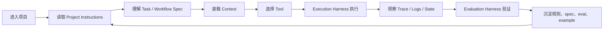

# Agent Project Infrastructure

> 本文研究一个问题：如何给项目和其中的 AI Agent 设计规则、边界、上下文、执行环境和评测标准，让 Agent 能稳定、可控、可复盘地工作？

## 结论

Agent 的表现不只取决于模型、提示词或工具数量，更取决于项目是否提供了足够清晰的基础设施。

我们将这套基础设施称为 **Agent Project Infrastructure**。它由六类能力组成：

| 分类 | 核心问题 | 典型载体 |
|---|---|---|
| Project Instructions | Agent 进入项目后先读什么，哪些规则具有约束力？ | `AGENTS.md`、目录级规则、团队协作约定 |
| Task / Workflow Spec | 模糊需求如何变成可执行、可验收的任务？ | spec、workflow、graph、DSL、任务模板 |
| Execution Harness | Agent 如何在可重复环境里执行、观察、修正？ | sandbox、runner、patch loop、命令封装、日志 |
| Evaluation Harness | 如何判断 Agent 真的做对，而不是看起来做对？ | trace、dataset、rubric、grader、benchmark |
| Tool Boundary & Permission Model | Agent 能调用什么，副作用如何授权和审计？ | tool schema、resource、approval、secret、policy |
| Context Architecture | Agent 如何获得刚好够用的上下文？ | repo map、microagent、memory、checkpoint、trace |

这六类不是资料目录，而是一条工作链路：规则定义行为边界，spec 定义任务目标，context 决定理解质量，tool boundary 限制行动范围，execution harness 提供反馈循环，evaluation harness 将经验沉淀成可回归的标准。

## 为什么第一篇写它

Agent Grove 后续会继续学习 prompt、RAG、多 Agent、长记忆、工作流编排和产品化，但这些都不能作为第一层地基。

如果项目没有清楚的 instructions，Agent 不知道哪些规则优先；如果没有 spec，Agent 只能围绕自然语言猜测任务边界；如果没有 harness，执行过程不可复现；如果没有 eval，结果只能靠主观感觉判断；如果没有 tool boundary，越强的 Agent 风险越高；如果没有 context architecture，大项目里的 Agent 很容易读错位置、遗漏约束或浪费窗口。

所以第一篇先写它：不是为了抽象地谈 Agent，而是先回答“一个项目怎样对 Agent 友好”。

## 研究样本

本文基于官方资料和代表性开源项目的源码观察。源码统一阅读自本地 `external/`，该目录不入库。

| 对象 | 来源 | 版本或日期 | 关注点 |
|---|---|---|---|
| AGENTS.md | <https://agents.md/> | 2026-05-04 阅读 | 项目规则入口、分层规则 |
| OpenAI Harness Engineering | <https://openai.com/index/harness-engineering/> | 2025-06-12 | harness、真实任务、反馈闭环 |
| OpenAI Agent Evals / Evals | OpenAI Developers | 2026-05-04 阅读 | trace、grader、dataset、eval run |
| Anthropic Building Effective Agents | Anthropic Engineering | 2024-12-19 | workflow / agent 区分、工具设计 |
| Anthropic Demystifying Evals | Anthropic Engineering | 2025-05-22 | agent harness 与 evaluation harness |
| MCP Specification | <https://modelcontextprotocol.io/specification/draft> | 2026-05-04 阅读 | host/client/server、tool/resource/prompt 边界 |
| OpenClaw | <https://github.com/openclaw/openclaw> | `e8d0cf75ea0e6c0db5a1468cb0715746fa3ad75e` | instructions、工具边界、QA scenario |
| Hermes Agent | <https://github.com/NousResearch/hermes-agent> | `8163d371922768c32f43eb6036d7d36e56775605` | 多渠道入口、memory、approval、runtime |
| OpenHands | <https://github.com/OpenHands/OpenHands> | `d3864d9992c4a7503b32e9fbc1fba8c4bf2bdf92` | sandbox、microagent、settings |
| SWE-agent | <https://github.com/SWE-agent/SWE-agent> | `0f4f3bba990e01ca8460b9963abdcd89e38042f2` | config spec、environment、tool filter、trajectory |
| Aider | <https://github.com/Aider-AI/aider> | `3ec8ec5a7d695b08a6c24fe6c0c235c8f87df9af` | repo map、git loop、lint/test、benchmark |
| Langfuse | <https://github.com/langfuse/langfuse> | `0256db00672babdeac527221186429ef258848ca` | trace、dataset、score、agent config |
| Ragas | <https://github.com/explodinggradients/ragas> | `298b68274234c060deacab3cf5fb52aa3a20e885` | metric、sample schema、tool call eval |
| Dify | <https://github.com/langgenius/dify> | `cd9daef564369b3926ce7fed242a1feb5c4a451f` | workflow DSL、graph runtime、tool adapter |
| LangGraph | <https://github.com/langchain-ai/langgraph> | `a0c4bdc3cb88e371a0fee00b6479509e9c9a8a72` | state graph、checkpoint、runtime context |

## 生命周期模型

一个 Agent 在项目中完成任务，通常会经历下面的链路：

这条链路解释了为什么单独优化 prompt 往往不够。Agent 的失败可能不是“模型不聪明”，而是项目没有告诉它边界、没有暴露正确上下文、没有提供可重复执行环境，或没有把失败转化为 eval。

## 六类基础设施

### 1. Project Instructions

Project Instructions 是 Agent 进入项目后的规则入口。它应该告诉 Agent：先读什么、哪些目录有额外规则、哪些命令可信、哪些行为需要审批、什么样的修改必须验证。

`AGENTS.md` 的价值在于它把“给 Agent 的项目规则”从 README、聊天记录和个人偏好里抽出来，变成一个稳定、可发现、可分层的入口。官方 AGENTS.md 约定也强调：README 面向人，`AGENTS.md` 面向 Agent；目录下可以有更近的 `AGENTS.md` 覆盖局部规则。

项目观察：

- OpenClaw 的根 `AGENTS.md` 不只是开发说明，而是项目路由器：它规定 scoped `AGENTS.md` 的读取顺序、可用命令、验证 gates、提交规则、权限边界和安全规则。
- Langfuse 的 `.agents/` 进一步把多工具配置统一为 repo-owned source of truth，再生成 Claude、Codex、Cursor、VSCode 等工具的 shim，避免规则散落在各工具私有目录。
- OpenHands 使用 microagents 表达可触发的专项提示词，让项目知识不必全部塞进一个全局说明。

工程判断：优秀的 Project Instructions 不追求长，而追求可执行。它应该像“项目操作系统的入口表”，而不是一篇百科。

### 2. Task / Workflow Spec

Spec 解决的是任务边界问题：做什么、不做什么、验收标准是什么、哪些输入输出必须稳定。

在传统软件工程里，spec 常常是需求文档或接口契约；在 Agent 项目里，spec 还可能是 workflow、graph、DSL、任务模板或 benchmark instance。它不一定是 Markdown，但必须能约束 Agent 行为。

项目观察：

- SWE-agent 的 `config/default.yaml` 把系统提示、任务模板、实例模板、review checklist、工具 bundle、history processor 放在同一个可版本化配置中。它本质上是 coding agent 的任务执行 spec。
- Dify 将应用逻辑表达为 workflow graph，并通过 DSL import/export 管理节点、变量、工具和敏感信息。这里的 spec 是可运行的业务图，而不只是文字。
- LangGraph 用 `StateGraph`、节点、边和 checkpoint 表达 agentic workflow。图结构本身就是“哪些步骤可以发生、状态如何流动”的 spec。
- OpenAI Symphony 的公开案例中，`SPEC.md` 用于高层策略，`WORKFLOW.md` 用于任务拆解和并行 worktree 协作，说明 spec 与执行流程可以分层管理。

工程判断：prompt 是一次对话里的指令，spec 是项目可维护的任务契约。长期项目不能只靠 prompt 记忆。

### 3. Execution Harness

Execution Harness 是围绕模型的一整套工作环境，而不只是脚本。OpenAI 对 harness engineering 的定义很接近这个判断：harness 包含工具、环境、反馈机制，以及让模型能真实工作的上下文。

对 coding agent 来说，Execution Harness 至少包括：依赖安装、沙箱、工作目录、命令入口、测试循环、日志、artifact、失败恢复、超时策略和 patch loop。

项目观察：

- SWE-agent 明确拆分 agent loop、environment、deployment、tool handler 和 trajectory。它会重置仓库、启动 bash session、执行 action、处理格式错误和 blocklist，再保存轨迹。
- OpenHands 将 agent 执行放入 sandbox service，强调容器化执行、生命周期管理、用户级访问控制和 sandbox settings。
- Aider 将 git、lint、test、auto-fix、auto-commit 连成开发循环。它的核心价值不是“能改文件”，而是把改动放进一个可观察、可回退、可验证的 loop。
- OpenClaw 的 QA scenario 和 frontier harness plan 说明 harness 还可以覆盖“模型切换后工具连续性”“approval 后是否继续执行”等行为级场景。

工程判断：Execution Harness 的目标是让 Agent 可以安全失败、快速复现、持续修正。没有 harness 的 Agent 更像一次性脚本。

### 4. Evaluation Harness

Evaluation Harness 与 Execution Harness 必须分开看。前者负责“怎么跑”，后者负责“怎么判”。Anthropic 在 eval 文章中也明确区分 agent harness 和 evaluation harness，这一点与 OpenAI Evals 的 trace/dataset/grader 思路一致。

Agent eval 不应该只看最终文本是否好看。它至少可以评估：

- 是否完成用户目标。
- 是否调用了正确工具。
- 是否违反 instructions 或安全边界。
- 是否产生不必要副作用。
- 是否能在同一任务集上稳定回归。

项目观察：

- OpenAI Agent Evals 强调先用 trace 观察单次行为，再把稳定问题沉淀为 dataset 和 eval run。
- Langfuse 将 trace、observation、dataset run item、score、evaluator config、annotation queue 产品化，说明生产级 eval 本质上是观测和评分系统。
- Ragas 提供 sample schema、metric、rubric 和 tool-call accuracy 一类指标，证明 eval 需要结构化样本，而不是临时人工判断。
- SWE-agent 接入 SWE-Bench evaluation hook，把 coding agent 的结果提交为可评测预测。

工程判断：没有 eval，项目就无法知道某个 prompt、工具或规则调整到底让 Agent 变好了还是只是换了一种失败方式。

### 5. Tool Boundary & Permission Model

Tool Boundary 不是简单列工具名，而是回答：哪些能力是只读上下文，哪些能力会产生副作用，哪些能力需要审批，哪些 secret 可以进入运行时，哪些操作必须被记录。

MCP 的 tool / resource / prompt 分工提供了一个有用的底层视角：resource 更像上下文，tool 更像行动能力。把只读数据建模成 tool，会放大权限面；把有副作用的 tool 当作普通函数，会低估风险。

项目观察：

- SWE-agent 的 tool filter 会阻止交互式命令，处理 timeout，并用 parser 约束模型输出格式。
- OpenHands 的 sandbox settings 和 secret 传递机制把执行环境、凭证、MCP、确认模式放进配置，而不是散落在 prompt 里。
- Dify 的 DSL export 会按需移除 tool/agent 节点中的敏感凭证，并对 workflow-as-tool 做运行时适配。
- Hermes Agent 在多平台入口中处理 approval、sandbox-aware tool result、session scope 和 memory isolation，说明 permission model 必须覆盖平台状态和用户会话。
- OpenClaw 的 channel allowlist、approval scenario 和安全规则说明：工具边界既有静态配置，也有运行时交互。

工程判断：Agent 越能干，越需要清楚的权限模型。否则“更强的自动化”会直接变成“更大的不可控副作用”。

### 6. Context Architecture

Context Architecture 需要拆成两个子层，但暂不拆成两个顶层分类：

- Repository Knowledge：项目里的稳定知识，例如目录结构、源码索引、局部规则、API 文档、架构图。
- Runtime Context：执行中的动态状态，例如对话历史、trace、tool result、memory、checkpoint、session。

它们都回答“Agent 应该知道什么”，但生命周期不同。Repository Knowledge 帮 Agent 进入项目，Runtime Context 帮 Agent 在任务中保持连续性。

项目观察：

- Aider 的 repo map 用 AST / tree-sitter tag 和 token budget 组织代码库视图，让模型不必读取完整仓库。
- OpenHands 的 microagent 用触发规则按需注入专项上下文，避免全局说明无限膨胀。
- LangGraph 的 checkpoint、thread 和 state graph 说明 runtime context 可以被持久化、恢复和分支。
- Hermes Agent 的 SessionDB、FTS search、context compressor 和 memory provider 说明个人 Agent 需要跨会话上下文，但也必须有 profile/session 隔离。
- Langfuse 的 trace/observation 说明 context 不只是给模型读，也要给人和 eval 系统复盘。

工程判断：大项目里的上下文架构不能靠“把所有资料塞进去”。好的上下文系统应该能路由、压缩、恢复、追踪和过期。

## 分类修正

最初的六类分类基本成立，但需要三处修正：

| 原分类 | 修正后 | 原因 |
|---|---|---|
| Spec | Task / Workflow Spec | 源码观察显示 spec 不一定是文档，也可能是 graph、DSL、template 或 benchmark instance。 |
| Harness | Execution Harness | 需要与 Evaluation Harness 明确区分。前者负责执行环境和反馈循环，后者负责判分和回归。 |
| Tool Boundary | Tool Boundary & Permission Model | 项目案例普遍把 tool schema、审批、secret、sandbox、审计放在一起处理。 |
| Context Architecture | Context Architecture，内部分 Repository Knowledge / Runtime Context | Aider、OpenHands 偏 repo knowledge；LangGraph、Hermes、Langfuse 偏 runtime context。二者相关但生命周期不同。 |

因此，Agent Grove 当前采用“六类顶层框架，内部细分关键子层”的方式，不急于扩成更多目录。目录结构要等 example 和文档成熟后再稳定下来。

## 最小 example 设计

第一批 example 不追求复杂产品形态，只验证这六类基础设施如何共同影响 Agent 表现。

建议设计一个小型 coding-agent maintenance example：

- 一个很小的业务模块，例如配置解析器、任务队列或规则引擎。
- 一份 `AGENTS.md`，只写入口规则、命令、验证要求和禁止事项。
- 一份任务 spec，包含目标、非目标、验收标准和可修改范围。
- 一个 execution harness，负责准备环境、运行失败用例、执行测试、收集日志。
- 一个 evaluation harness，至少包含固定 fixture、rubric 和 trace 检查点。
- 一个 tool boundary 配置，区分 read、write、shell、network、secret。
- 一个 context map，说明 Agent 应先读哪些文件，哪些信息只在失败时读取。

暂不纳入：

- RAG。
- 多 Agent 协作。
- 长期记忆。
- 云端部署。
- 复杂 UI。
- 自动发布。

这样做不是因为这些不重要，而是因为第一阶段要先验证基础链路。只有最小链路跑通后，复杂能力才有稳定承载面。

## Arbor 当前定位

Arbor 是 Agent Grove 的第一个 Agent。现阶段它不是全能助理，也不是自动生产系统，而是一个 **研究维护型 Agent**。

它当前应该做：

- 维护资料和源码快照，记录 repo、commit、阅读日期和关注模块。
- 检查文档中的关键判断是否能追溯到官方资料或项目案例。
- 把成熟结论沉淀进简洁文档，而不是堆链接。
- 维护最小 example 的边界，避免过早引入 RAG、多 Agent、长期记忆等复杂度。
- 在 Agent Grove 自身迭代时，帮助发现 instructions、spec、harness、eval、tool boundary、context architecture 的缺口。

它当前不应该做：

- 自主扩大研究范围。
- 未经确认创建大量目录和模板。
- 把外部项目完整架构搬运进文档。
- 把个人学习目标写进面向社区的项目首页。

## 对后续学习路径的影响

这篇文章给后续知识框架定了一个顺序：

1. 先学习怎样让项目对 Agent 可读、可执行、可验证。
2. 再学习单点能力，例如 tool calling、workflow、eval、memory、tracing。
3. 然后基于最小 example 做可运行实践。
4. 最后再考虑复杂产品形态，例如多 Agent、RAG、长期记忆和平台化。

这个顺序的核心是：先建立工程边界，再扩大 Agent 能力。

## 参考资料

- [AGENTS.md](https://agents.md/)
- [OpenAI: Harness engineering](https://openai.com/index/harness-engineering/)
- [OpenAI: Unlocking the Codex harness](https://openai.com/index/unlocking-the-codex-harness/)
- [OpenAI: Open-source Codex orchestration with Symphony](https://openai.com/index/open-source-codex-orchestration-symphony/)
- [OpenAI Evals](https://developers.openai.com/api/docs/guides/evals)
- [OpenAI Agent Evals](https://developers.openai.com/api/docs/guides/agent-evals)
- [Anthropic: Building effective agents](https://www.anthropic.com/engineering/building-effective-agents)
- [Anthropic: Demystifying evals for AI agents](https://www.anthropic.com/engineering/demystifying-evals-for-ai-agents)
- [MCP Specification](https://modelcontextprotocol.io/specification/draft)
