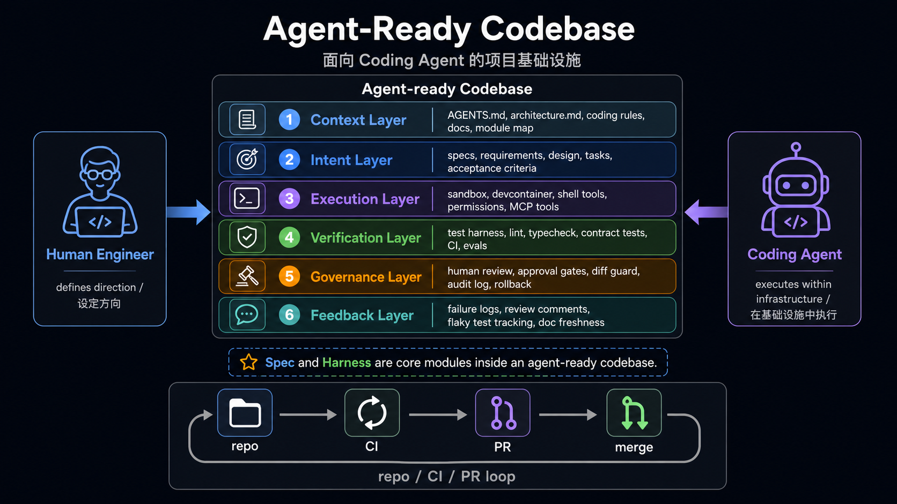

# Agent-Ready Engineering Infrastructure

Project infrastructure for Coding Agents is not about turning every repository into an agent product. It is also not just adding "please run tests first" to the README.

It answers a more concrete question: when Coding IDEs or Coding Agents such as Cursor, Codex, and Claude Code enter a real project, what engineering interfaces should the codebase provide so the agent can understand the project, make changes, verify outcomes, stay within governance boundaries, and improve from failures?

The core conclusion is short:

```text
Agent-ready repo
  = context
  + intent
  + execution
  + verification
  + governance
  + feedback
```



`spec` and `harness` are core modules, but they are not the whole story.

- `spec` mainly serves intent: what this task is trying to do, what is out of scope, and what counts as done.
- `harness` mainly connects execution, verification, and feedback: how code runs in a controlled environment, how correctness is proven, and how failures return to the agent and the team.

All code snippets below come from real open-source projects. To keep the reading flow light, each snippet keeps only the lines that directly support the infrastructure point being made.

The examples are not a complete matrix. A project is included in a layer only when its implementation is representative, useful as a reference, or shows a clear engineering trade-off.

## Scope

This article only studies **infrastructure that helps Coding Agents work on concrete projects**. If an open-source project is itself an agent product, this article does not analyze its agent loop, memory, tool calling, or model routing design unless those ideas are explicitly turned into rules, verification entry points, configuration, or governance mechanisms for developing the repository.

## The Six Layers

| Layer | Question | Common artifacts |
|---|---|---|
| Context | How does the agent understand the project and boundaries? | `AGENTS.md`, scoped guides, architecture maps, coding rules |
| Intent | How does the agent understand the current task? | spec, proposal, design, tasks, acceptance criteria |
| Execution | Where does the agent run, and with what permissions? | setup, Makefile, Docker, devcontainer, MCP/tool config |
| Verification | How does the agent prove the change is correct? | test, lint, typecheck, contract test, CI, eval harness |
| Governance | How are agent changes constrained and audited? | approval gates, CODEOWNERS, PR templates, diff guards, rollback |
| Feedback | How do failures and reviews flow back? | failure artifacts, coverage, trajectory, benchmark, flaky tracking |

Traditional codebases depend heavily on organizational memory: which modules are risky, which tests are flaky, which commands only run in CI, and which interfaces are public contracts. Coding Agents cannot reliably depend on that implicit knowledge. The essence of agent-ready infrastructure is to turn that knowledge into engineering interfaces inside the repository.

```text
Make implicit knowledge explicit
Structure explicit rules
Automate structured rules
Feed automation results back to the agent
```

## 1. Context Layer

Context Layer tells the agent what the project is, where to read, and which boundaries must not be broken. The minimal form is a root `AGENTS.md`; the mature form is usually a root guide plus scoped guides.

### Code Evidence: OpenClaw's `AGENTS.md` Is an Agent Operating Manual

`AGENTS.md` is not a duplicate README. OpenClaw's root file tells the agent which local rules to read first, where project boundaries are, which commands should not be called directly, and which changes trigger which gates.

```md
Root rules only. Read scoped `AGENTS.md` before subtree work.

## Map
- Core TS: `src/`, `ui/`, `packages/`; plugins: `extensions/`;
  SDK: `src/plugin-sdk/*`; channels: `src/channels/*`.
- Scoped guides exist in: `extensions/`, `src/{plugin-sdk,channels,plugins,gateway}/`,
  `test/helpers*/`, `docs/`, `ui/`, `scripts/`.

## Commands
- Smart gate: `pnpm check:changed`; explain `pnpm changed:lanes --json`.
- Targeted tests: `pnpm test <path-or-filter> [vitest args...]`; never raw `vitest`.

## Gates
- Changed lanes:
  - core prod: core prod typecheck + core tests
  - public SDK/plugin contract: extension prod/test too
```

This is the value of Context Layer: it does not merely tell the agent how to start the project. It compresses the repo map, scoped guide entry points, command constraints, ownership boundaries, and verification routes into executable working context.

### Code Evidence: Langfuse Converges Multi-Tool Rules Into `.agents/`

Langfuse does not hand-write separate configuration for every Coding IDE. It generates Claude, Codex, Cursor, and MCP configuration from `.agents/config.json`.

```js
const sourcePath = resolve(repoRoot, ".agents/config.json");
const config = JSON.parse(readFileSync(sourcePath, "utf8"));

const fileOutputs = [
  { path: resolve(repoRoot, ".claude/settings.json"), content: formatClaudeSettings() },
  { path: resolve(repoRoot, ".mcp.json"), content: formatSharedJsonConfig() },
  { path: resolve(repoRoot, ".codex/environments/environment.toml"), content: formatCodexEnvironmentToml() },
  { path: resolve(repoRoot, ".cursor/mcp.json"), content: formatSharedJsonConfig() },
  { path: resolve(repoRoot, ".cursor/environment.json"), content: formatCursorEnvironment() }
];
```

The trend is clear: when multiple agent IDEs coexist, teams need one canonical source and then project it into each tool's preferred format. LangGraph's much shorter guide also reminds us that Context Layer is not about length. It is about navigation.

A good Context Layer lets the agent answer:

- Which directory or module should this task start from?
- Is there a more specific scoped guide?
- Which public interfaces, dependency boundaries, or architecture boundaries must not be broken?
- Which commands should be run after the change?
- When must a human confirm the decision?

Representative cases:

| Project | Case | Reference value |
|---|---|---|
| OpenClaw | Root `AGENTS.md` plus scoped `AGENTS.md` files | Turns a large repo map, commands, gates, and ownership boundaries into an agent operating manual |
| Dify | Root `AGENTS.md` routes to `api/`, `web/`, and `e2e/` local rules | Multi-stack applications should let the root guide route and push details into subdomains |
| Langfuse | `.agents/AGENTS.md` as canonical source, synchronized to multiple tool configs | Avoids drift between Claude, Codex, Cursor, and MCP configuration |
| LangGraph | Minimal `AGENTS.md` | Shows that context does not need to be long when project boundaries are simple |

## 2. Intent Layer

Intent Layer helps the agent understand the goal, boundary, and acceptance criteria of the current task. Context is long-lived project policy; Intent is the task contract for this change.

| What the spec should express | Typical content |
|---|---|
| What to build | goal, user scenario, feature scope |
| What not to build | non-goals, exclusions, compatibility boundaries |
| What counts as done | acceptance criteria, scenario, example |
| What must not break | public contract, permissions, security, performance |
| How to verify | test, lint, typecheck, E2E, schema check |
| What to do when uncertain | open questions, conservative decision rules |

### Code Evidence: Spec Kit Splits Intent Into Staged Artifacts

Spec Kit is not just "one more spec file." It turns the path from principles to implementation into agent-executable commands.

```text
/speckit.constitution  -> project principles
/speckit.specify       -> what and why
/speckit.plan          -> technical plan
/speckit.tasks         -> implementation tasks
/speckit.implement     -> execute tasks
```

Its workflow also places spec and plan behind human review gates:

```yaml
inputs:
  spec:
    type: string
    prompt: "Describe what you want to build"

steps:
  - id: specify
    command: speckit.specify

  - id: review-spec
    type: gate
    options: [approve, reject]

  - id: plan
    command: speckit.plan

  - id: review-plan
    type: gate
    options: [approve, reject]

  - id: tasks
    command: speckit.tasks

  - id: implement
    command: speckit.implement
```


The infrastructure meaning is:

- Project principles are persisted in `.specify/memory/constitution.md`, so later specs, plans, and tasks follow the same rules.
- "Think before coding" becomes an agent command rather than a one-off human reminder.
- Review happens at the spec and plan stages, before the agent produces a large diff in the wrong direction.

### Code Evidence: OpenSpec Turns Changes Into a Delta Lifecycle

OpenSpec follows a different route. It behaves more like a long-lived behavior specification system: current behavior lives in `specs/`, active changes live in `changes/`, and completed changes are archived.

```text
openspec/
  specs/
    <current-system-behavior>/
  changes/
    <active-change>/
      proposal.md
      design.md
      tasks.md
      specs/
    archive/
      <completed-change>/
```


In a real change, `proposal.md` first defines why, what, and non-goals:

```md
## What Changes

Add the first user-facing workspace setup flow:

openspec workspace setup
openspec workspace list
openspec workspace link /path/to/api
openspec workspace relink api /new/path/to/api
openspec workspace doctor

## Non-Goals

- No public `openspec workspace create` command in this first release.
- No agent launch or workspace open behavior.
- No apply, verify, archive, branch, or worktree behavior.
```

The delta spec then turns behavior into requirements and scenarios:

```md
## MODIFIED Requirements

### Requirement: Stable Workspace Name
OpenSpec SHALL use one kebab-case workspace name across workspace identity,
managed storage, and the local registry.

#### Scenario: Rejecting invalid workspace names
- WHEN OpenSpec accepts a workspace name
- THEN it SHALL require kebab-case names using lowercase letters, numbers,
  and single hyphen separators
```

`tasks.md` turns intent into checkable implementation and verification work:

```md
- [x] Implement `openspec workspace setup` as the only public creation path
- [x] Fail cleanly when non-interactive setup is missing a name or link
- [x] Run `openspec validate workspace-create-and-register-repos --strict`
- [x] Run targeted command tests for workspace setup/list/link/relink/doctor
```

Spec Kit and OpenSpec share the same underlying goal: make human intent consumable, traceable, and reviewable by agents. The difference is that Spec Kit leans toward a staged pipeline, while OpenSpec leans toward a change and delta-spec lifecycle.

Representative cases:

| Project | Case | Reference value |
|---|---|---|
| Spec Kit | constitution / specify / plan / tasks / implement | Good for greenfield work or large features that need a staged artifact pipeline |
| OpenSpec | `specs/` source of truth + `changes/` delta spec + archive | Good for existing projects where each behavior change needs reviewable lifecycle management |
| Dify | `api/AGENTS.md` treats docstrings and comments as spec | Keeps invariants, edge cases, and trade-offs close to the code they constrain |
| Langfuse | Public API contract changes must update Fern sources and generated outputs | Intent is not only requirements text; it can also be API contracts and schema sources of truth |

## 3. Execution Layer

Execution Layer lets the agent execute work in a reproducible, controlled, bounded environment. It is not merely about "getting the project to run"; it also reduces environment guessing and dangerous side effects.

It does include test commands and workflows, but it is not the same as Verification Layer.

| Question | Layer | Example |
|---|---|---|
| How to install dependencies, start services, reset data, or open a browser | Execution | `e2e:install`, `e2e:middleware:up`, `e2e:reset` |
| Where code runs, whether network is allowed, how secrets are handled | Execution | Docker, sandbox, devcontainer, MCP/tool config |
| Which checks this change must run | Verification | API changes run API tests; migration changes run migration checks |
| What counts as passing, and where failure artifacts live | Verification | required checks, coverage, E2E report, benchmark output |

The same test command can cross both layers: Execution defines how to run it; Verification defines when it must run, how to judge the result, and how failures flow back.

### Code Evidence: Dify Scripts E2E Execution Entry Points

Dify's E2E package does not merely say "run E2E tests." It scripts installation, middleware startup, reset, full runs, and headed runs.

```json
{
  "scripts": {
    "e2e": "tsx ./scripts/run-cucumber.ts",
    "e2e:full": "tsx ./scripts/run-cucumber.ts --full",
    "e2e:install": "playwright install --with-deps chromium",
    "e2e:middleware:up": "tsx ./scripts/setup.ts middleware-up",
    "e2e:middleware:down": "tsx ./scripts/setup.ts middleware-down",
    "e2e:reset": "tsx ./scripts/setup.ts reset"
  }
}
```

End-to-end tests often depend on browsers, backend services, middleware, seed data, and reset order. Turning those into commands is far more reliable than asking the agent to infer the process from documentation.

### Code Evidence: OpenHands Writes Real Runtime Pitfalls Into the Execution Entry Point

OpenHands' `AGENTS.md` does more than list commands. It documents the environment problems agents will actually hit in a local sandbox.

```md
make build && make run FRONTEND_PORT=12000 FRONTEND_HOST=0.0.0.0 \
  BACKEND_HOST=0.0.0.0 &> /tmp/openhands-log.txt &

Local run troubleshooting notes:
- If the backend fails with `nc: command not found`, install `netcat-openbsd`.
- If local runtime startup fails with `duplicate session: test-session`,
  clear the stale tmux session.
- In this sandbox environment, an inherited `SESSION_API_KEY` can make
  `/api/v1/settings` return 401 in the browser. Unset it before `make run`.

IMPORTANT: Before making any changes to the codebase, ALWAYS run
`make install-pre-commit-hooks`.
```

Humans often treat this as experience. Agents need it inside the repository. A mature Execution Layer turns real environment pitfalls into executable preconditions.

### Code Evidence: Aider Benchmarks Run Isolated by Default

Aider's benchmark executes code generated by an LLM, so it explicitly requires Docker.

```md
The benchmark is intended to be run inside a docker container.
This is because the benchmarking harness will be taking code written by an LLM
and executing it without any human review or supervision.

./benchmark/docker_build.sh
./benchmark/docker.sh
./benchmark/benchmark.py a-helpful-name-for-this-run --model gpt-3.5-turbo
```

Execution Layer therefore includes safety boundaries. When agent or model output is executed, sandbox or Docker isolation is not a nice-to-have. It is infrastructure.

Implementation guidance:

- Small projects need at least one reliable setup/test/build entry point.
- Medium and large projects should distinguish local quick checks, PR checks, and CI-only checks.
- If model-generated code will be executed, default to Docker or sandbox isolation.
- MCP/tool config should not be hand-maintained forever across multiple IDE-specific files.

Representative cases:

| Project | Case | Reference value |
|---|---|---|
| Dify | E2E package scripts manage install, middleware up/down, reset, and full runs | Scripts complex E2E execution so the agent does not guess |
| OpenHands | run/build/pre-commit plus sandbox troubleshooting | Makes real local development problems explicit, especially for complex apps |
| Aider | benchmark must run in Docker | Treats execution of LLM-generated code as a safety boundary |
| Langfuse | `scripts/codex/setup.sh`, Playwright install, MCP/Codex/Cursor environment generation | Execution includes agent tools and environment bootstrap, not only shell commands |

## 4. Verification Layer

Verification Layer lets the project automatically judge whether the agent actually did the right thing.

The relationship between spec and harness can be summarized as:

> Spec defines correctness. Harness makes correctness executable.


### Code Evidence: Dify Uses Path Filters to Select CI

Dify's main CI first determines which areas changed, then triggers API, web, E2E, vector database, and migration workflows.

```yaml
check-changes:
  outputs:
    api-changed: ${{ steps.changes.outputs.api }}
    e2e-changed: ${{ steps.changes.outputs.e2e }}
    web-changed: ${{ steps.changes.outputs.web }}
    vdb-changed: ${{ steps.changes.outputs.vdb }}
    migration-changed: ${{ steps.changes.outputs.migration }}
  steps:
    - uses: dorny/paths-filter@...
      with:
        filters: |
          api:
            - 'api/**'
          web:
            - 'web/**'
            - 'packages/**'
          e2e:
            - 'api/**'
            - 'e2e/**'
            - 'web/**'
          migration:
            - 'api/migrations/**'
```

This is not product logic. It is a verification planner for agents: the changed surface determines the checks that should run. Large projects cannot ask agents to blindly run everything every time, but they also cannot let affected areas be missed.

### Code Evidence: OpenClaw Implements Changed Gates as Project Code

OpenClaw does not rely only on CI YAML. It encodes path classification, impact, and reasons inside repository scripts.

```js
const DOCS_PATH_RE = /^(?:docs\/|README\.md$|AGENTS\.md$|.*\.mdx?$)/u;
const EXTENSION_PATH_RE = /^extensions\/[^/]+(?:\/|$)/u;
const CORE_PATH_RE = /^(?:src\/|ui\/|packages\/)/u;
const PUBLIC_EXTENSION_CONTRACT_RE =
  /^(?:src\/plugin-sdk\/|src\/plugins\/contracts\/|src\/channels\/plugins\/)/u;

if (PUBLIC_EXTENSION_CONTRACT_RE.test(changedPath)) {
  lanes.core = true;
  lanes.coreTests = true;
  lanes.extensions = true;
  lanes.extensionTests = true;
  reasons.push(`${changedPath}: public core/plugin contract affects extensions`);
}
```

This is stronger than a natural-language rule. It tells the agent that changing a public plugin contract cannot be verified with core tests alone; extension checks are part of the impact surface.

### Code Evidence: Hermes Agent Uses a Test Runner to Remove Local/CI Drift

Hermes Agent does not recommend running `pytest` directly. It provides a canonical test runner that fixes environment settings, blanks credential-shaped variables, and pins worker count.

```bash
# inside an env-var loop
case "$name" in
  *_API_KEY|*_TOKEN|*_SECRET|*_PASSWORD|*_CREDENTIALS|GH_TOKEN|GITHUB_TOKEN)
    unset "$name"
    ;;
esac

export TZ=UTC
export LANG=C.UTF-8
export PYTHONHASHSEED=0
WORKERS="${HERMES_TEST_WORKERS:-4}"

exec "$PYTHON" -m pytest \
  -o "addopts=" \
  -n "$WORKERS" \
  --ignore=tests/integration \
  --ignore=tests/e2e \
  "${ARGS[@]}"
```

This matters for Coding Agents. An agent does not know what API keys, locale, CPU count, or shell state exist on a developer machine. A hermetic runner makes "it passed locally" closer to a CI-quality signal.

The core rule for Verification Layer:

```text
Important rules in the spec should have corresponding checks in the harness.
```

If the spec says "public API schema must not change," the harness should include a contract test or schema diff.  
If the spec says "migration must be reversible," the harness should include migration dry-run or rollback checks.  
If the spec says "no cross-owner dependency," the harness should include import boundary or dependency ownership checks.

Representative cases:

| Project | Case | Reference value |
|---|---|---|
| Dify | path-filter CI plus stable required checks | Large apps select API/web/E2E/migration checks from changed surfaces |
| OpenClaw | `changed-lanes.mjs` turns path impact into code | Verification planning no longer depends on human memory, especially for public contract spread |
| Hermes Agent | canonical test runner blanks env, pins workers, excludes integration/e2e | Reduces local/CI drift and makes agent test conclusions more trustworthy |
| Ragas | Makefile aggregates `format`, `type`, `check`, `run-ci`, and `benchmarks` | General-purpose libraries can expose a stable harness through a small command surface |
| Aider / SWE-agent | benchmark/eval harness records pass rate, cost, trajectory | Validating agent capability itself requires reproducible evals, not just one-off tests |

## 5. Governance Layer

Governance Layer constrains, audits, approves, and rolls back agent changes. This is the difference between "an agent can write code" and "we can let an agent into a real project."

### Code Evidence: OpenHands Gives Complex PRs a Temporary Evidence Directory

OpenHands allows complex PRs to store design rationale, debug logs, E2E results, and other temporary material in `.pr/`, but does not want that content merged into the main branch.

```yaml
if [ -d ".pr" ]; then
  git config user.name "allhands-bot"
  git rm -rf .pr/
  git commit -m "chore: Remove PR-only artifacts [automated]"
  git push
fi
```

The design is useful because governance is not only about forbidding what agents can do. It can also give agents a temporary workspace where process evidence is visible without polluting the long-lived codebase. OpenClaw's `AGENTS.md` reflects the same principle by putting broad gates, Testbox, owner review, release approval, and PR verification into the operating rules agents must read.

### Code Evidence: Langfuse Turns PR Rules Into Checks

Langfuse's PR template requires Conventional Commit titles, self-review, tests, and documentation checks; a workflow then validates the title automatically.

```yaml
name: "Validate PR Title"

on:
  pull_request:
    types: [opened, edited, synchronize, reopened]

jobs:
  validate-pr-title:
    steps:
      - name: Validate PR title follows conventional commits
        uses: amannn/action-semantic-pull-request@...
        with:
          types: |
            feat
            fix
            docs
            refactor
            test
            security
```

This matters for agents because "how a PR enters collaboration" becomes a machine-checkable governance boundary, not just reviewer feedback.

Governance Layer should make clear:

- Which files or directories can be modified.
- Which public contracts need owner review.
- Which commands can run locally and which belong to CI or remote systems.
- Which check failures must be fixed and which can be explained.
- Which temporary evidence may enter a PR and which must never merge to main.

Representative cases:

| Project | Case | Reference value |
|---|---|---|
| OpenHands | `.pr/` temporary artifacts plus cleanup after approval | Gives complex agent PRs an evidence space while keeping main clean |
| OpenClaw | owner review, Testbox, release approval, PR verification in `AGENTS.md` | High-risk repos must state which actions require human approval |
| Langfuse | PR template + semantic PR title workflow + CodeQL/Snyk | Turns review hygiene and security checks into automatic gates |
| Dify | semantic PR title + layered CI required checks | Large apps use stable check names and PR rules to maintain merge gates |

## 6. Feedback Layer

Feedback Layer lets failures, review comments, and quality signals flow back so the next agent run improves. This layer is still early, but several patterns are already visible.

### Code Evidence: Failure Is an Artifact, Not Terminal Output

Dify's E2E workflow uploads logs, and SWE-agent's CI uploads trajectories. The shared idea is that failure should not remain in a single terminal session. It should become downloadable, reviewable material that an agent can inspect in the next step.

```yaml
# Dify web-e2e
- name: Upload E2E logs
  uses: actions/upload-artifact@...
  with:
    name: e2e-logs
    path: e2e/.logs

# SWE-agent pytest
- name: Upload logs & trajectories
  uses: actions/upload-artifact@v7
  if: always()
  with:
    name: trajectories-py${{ matrix.python-version }}
    path: trajectories/runner/
```

Aider's benchmark report records the key context of an eval run:

```yaml
model: claude-3.5-sonnet
edit_format: diff
commit_hash: 35f21b5
pass_rate_1: 57.1
percent_cases_well_formed: 99.2
syntax_errors: 1
test_timeouts: 1
total_cost: 3.6346
```

Feedback Layer has three kinds of value:

1. When the current task fails, the agent can read concrete artifacts instead of guessing again.
2. During human review, reviewers can see what verification the agent actually ran, not just its natural-language promise.
3. Over time, repeated failures can be written back into Context, Intent, or Verification Layer.

Representative cases:

| Project | Case | Reference value |
|---|---|---|
| Dify | API/web/E2E coverage and E2E log artifacts | Failures flow back by subsystem, making the next agent step easier to localize |
| SWE-agent | trajectory artifacts | Reviewers can replay the agent behavior path, not only the final result |
| Aider | benchmark YAML records model, commit, pass rate, cost, and error types | Eval results become comparable and reproducible |
| OpenClaw | changed lane reasons, timing, performance notes | The agent can understand why checks ran and which ones are expensive |
| Langfuse | `agents:check` detects multi-tool config drift | Agent configuration itself enters the feedback loop |

## Cross-Project Observations

The table below only looks at how these projects let Coding Agents participate in development. It does not evaluate their product shape.

| Project | What the code shows | Practical lesson |
|---|---|---|
| OpenClaw | `AGENTS.md`, scoped guides, changed lane scripts, gate rules | Large repos need agent operating manuals and coded verification planners |
| Langfuse | `.agents/` canonical source, MCP/Cursor/Codex/Claude config generation | Multiple agent IDEs need a shared source of truth to avoid drift |
| Dify | root/scoped `AGENTS.md`, E2E scripts, path-filter CI | Large apps should split context and checks by subdomain |
| OpenHands | setup troubleshooting, pre-commit, `.pr/` cleanup workflow | Complex PRs need process evidence while the main branch stays clean |
| Hermes Agent | hermetic test runner, credential env cleanup, fixed workers | Harnesses should actively remove local/CI drift |
| LangGraph | minimal agent guide, unified make commands | When a project is simple, a short guide can be enough |
| Spec Kit | specify / plan / tasks / implement + review gate | Intent Layer can be a staged pipeline |
| OpenSpec | `specs/` + `changes/` + archive | Existing projects benefit from delta specs that maintain behavior changes |
| Aider | Docker benchmark harness, pass rate/cost/error report | Eval harnesses should isolate execution and record reproducible metrics |
| SWE-agent | Docker sandbox, batch mode, trajectory artifacts | Agent evaluation needs instances, environments, patches, and evaluation loops |
| Ragas | Makefile checks, CI matrix, benchmarks | General-purpose libraries can provide a stable harness through clear commands |

Common patterns are emerging:

- Context files are becoming standard, but formats are still fragmented.
- Scoped guides are more maintainable than one giant root file.
- Verification is the most mature consensus; the difference is whether there is a unified entry point and changed gate.
- Spec workflows are still diverging, but "create reviewable artifacts before coding" is clearly becoming the direction.
- Governance becomes very concrete in higher-risk projects.
- Feedback Layer is early, but benchmarks, trajectories, artifacts, and config drift checks are already visible.

The divergences are also clear:

- Some projects use minimal guides; others use detailed operating manuals.
- Some treat specs as long-lived sources of truth; others keep them only for a PR or feature.
- Some try to reproduce CI locally; others explicitly push heavy checks to remote or CI-only environments.
- Some aggregate checks with Makefiles; others write dedicated changed-gate scripts.
- Some scatter agent config across tool directories; others use `.agents/` as a canonical source.

## From Ordinary Repo to Agent-Ready Repo

An ordinary project does not need to adopt Spec Kit, OpenSpec, eval harnesses, and complex CI gates all at once. A more practical path is staged maturity.


| Level | Goal | Minimal action |
|---|---|---|
| 0. Ordinary repo | README, source code, and some tests, while key rules live in people's heads | None; the agent can only search and guess |
| 1. Agent Context Ready | The agent understands project structure, commands, and boundaries | Write a root `AGENTS.md`; add scoped guides for large areas |
| 2. Spec Ready | The agent understands the task contract for this change | Use lightweight specs for small changes; requirements/design/tasks for medium features; OpenSpec for existing systems; Spec Kit for large or greenfield features |
| 3. Harness Ready | The agent can verify changes through a unified entry point | Provide `./scripts/verify.sh`, `make check`, or `pnpm check`, and explain quick/PR/CI-only checks |
| 4. Agent Workflow Ready | The six layers connect into the daily workflow | Define the sequence: read guide, produce spec, change code, verify, submit evidence, enter review |
| 5. Continuous Agent Improvement | Failures and review feed back into infrastructure | Track failure patterns, write repeated review comments into guides, and add missing cases to spec or harness |

Level 4 can be very simple:

```text
Read AGENTS.md
  -> read scoped guide
  -> read or generate spec / tasks
  -> make the change
  -> run harness
  -> submit verification evidence
  -> enter PR review / approval gate
```

## What This Means for Agent Grove

This article should not only be the first published piece. It should become a roadmap for building Agent Grove itself.

We already have:

- `AGENTS.md`: the project collaboration entry point.
- `README.md` / `README.zh-CN.md`: project positioning and knowledge framework draft.
- VitePress documentation site and GitHub Pages workflow.
- Local `external/` research material, which does not enter the formal content tree.

The next steps can move along three lines.

First, build the Agent Grove repository itself. Following OpenClaw, Dify, and Langfuse, we should not rush to create empty `specs/`, `evals/`, `harnesses/`, or `case-studies/` directories. Let real work pull the infrastructure into existence:

- Context: keep maintaining `AGENTS.md`; add scoped guides when docs, research, code, and Arbor begin to diverge.
- Intent: each formal research topic should start with a lightweight task contract that states the question, scope, evidence bar, and deliverable shape.
- Execution: document real commands for building the docs site, handling image assets, and checking references.
- Verification: treat `npm run docs:build` as the current minimal harness; later add link checks, image existence checks, and reference format checks.
- Governance: keep `external` research material out of the formal content tree, and do not package immature content as a finished article.
- Feedback: write repeated review issues back into writing rules or article templates instead of leaving them only in conversation.

Second, keep examples as minimal validation slices. Examples are useful, but they should not exist just to make the repo look complete. Create them when an idea is hard to explain in prose or needs runnable evidence:

- A minimal `AGENTS.md` plus scoped guide example for Context Layer.
- A lightweight spec plus verify script example for the Intent-to-Verification connection.
- A failure artifact feedback example for Feedback Layer.

Each example should demonstrate one concept and support article conclusions. It should not become a separate tutorial repo.

Third, build Arbor. Arbor is not a helper for writing articles or doing research. It is the lightweight learning version of OpenClaw that Agent Grove should actually iterate: a code-oriented Agent project for practicing agent engineering infrastructure.

Arbor can start small, but it should enter a real development shape early:

- It has its own code directory, module boundaries, and agent-facing guide.
- It has lightweight specs describing each capability increment, non-goals, and acceptance criteria.
- It has an execution harness that can run the minimal agent loop, tool calls, and task flow in a controlled environment.
- It has a verification harness that can decide whether a task was completed according to spec, not just by reading natural-language output.
- It has governance boundaries for files, commands, tools, and external side effects that need restriction or human approval.
- It has feedback artifacts that record failure traces, test results, cost, latency, and replayable execution paths.

Examples remain valuable, but they are single-point experiments outside Arbor. When a concept does not yet belong in Arbor, or when it needs a very small runnable slice, create an example. Long term, Arbor should be the system that carries the multi-layer infrastructure, not a pile of isolated demos.

Therefore, Agent Grove should not become a tutorial collection for Spec Kit, OpenSpec, or Harness engineering. The external docs and official tutorials are already detailed. We should absorb them as cases and evidence, turn them into our own engineering judgment, and write future articles around how a project solves a concrete agent engineering problem. The final output should feed back into Arbor as a real system.

This matches the core claim of the article: agent-ready infrastructure is not about creating every directory at once. It is about gradually engineering the context, intent, execution, verification, governance, and feedback that real collaboration repeatedly needs.

## References

- [AGENTS.md](https://agents.md/)
- [OpenAI Codex AGENTS.md guide](https://developers.openai.com/codex/guides/agents-md)
- [OpenAI: Harness engineering for reliable agents](https://openai.com/index/harness-engineering/)
- [GitHub Spec Kit README](https://github.com/github/spec-kit/blob/1994bd766ea2a3b1d9d87dcec18abc9410f39834/README.md)
- [Spec Kit workflow definition](https://github.com/github/spec-kit/blob/1994bd766ea2a3b1d9d87dcec18abc9410f39834/workflows/speckit/workflow.yml)
- [OpenSpec Getting Started](https://github.com/Fission-AI/OpenSpec/blob/7c3acccaf7d01006e3aac2194a2a1967e4d66984/docs/getting-started.md)
- [OpenSpec Workflows](https://github.com/Fission-AI/OpenSpec/blob/7c3acccaf7d01006e3aac2194a2a1967e4d66984/docs/workflows.md)
- [OpenSpec workspace change example](https://github.com/Fission-AI/OpenSpec/tree/7c3acccaf7d01006e3aac2194a2a1967e4d66984/openspec/changes/workspace-create-and-register-repos)
- [OpenClaw AGENTS.md](https://github.com/openclaw/openclaw/blob/e8d0cf75ea0e6c0db5a1468cb0715746fa3ad75e/AGENTS.md)
- [OpenClaw changed lanes](https://github.com/openclaw/openclaw/blob/e8d0cf75ea0e6c0db5a1468cb0715746fa3ad75e/scripts/changed-lanes.mjs)
- [Langfuse agent guide](https://github.com/langfuse/langfuse/blob/0256db00672babdeac527221186429ef258848ca/.agents/AGENTS.md)
- [Langfuse agent config sync](https://github.com/langfuse/langfuse/blob/0256db00672babdeac527221186429ef258848ca/scripts/agents/sync-agent-shims.mjs)
- [LangGraph AGENTS.md](https://github.com/langchain-ai/langgraph/blob/a0c4bdc3cb88e371a0fee00b6479509e9c9a8a72/AGENTS.md)
- [Dify AGENTS.md](https://github.com/langgenius/dify/blob/cd9daef564369b3926ce7fed242a1feb5c4a451f/AGENTS.md)
- [Dify API Agent Guide](https://github.com/langgenius/dify/blob/cd9daef564369b3926ce7fed242a1feb5c4a451f/api/AGENTS.md)
- [Dify E2E Agent Guide](https://github.com/langgenius/dify/blob/cd9daef564369b3926ce7fed242a1feb5c4a451f/e2e/AGENTS.md)
- [Dify E2E package scripts](https://github.com/langgenius/dify/blob/cd9daef564369b3926ce7fed242a1feb5c4a451f/e2e/package.json)
- [Dify main CI workflow](https://github.com/langgenius/dify/blob/cd9daef564369b3926ce7fed242a1feb5c4a451f/.github/workflows/main-ci.yml)
- [Dify Web E2E workflow](https://github.com/langgenius/dify/blob/cd9daef564369b3926ce7fed242a1feb5c4a451f/.github/workflows/web-e2e.yml)
- [Dify semantic PR workflow](https://github.com/langgenius/dify/blob/cd9daef564369b3926ce7fed242a1feb5c4a451f/.github/workflows/semantic-pull-request.yml)
- [OpenHands AGENTS.md](https://github.com/OpenHands/OpenHands/blob/d3864d9992c4a7503b32e9fbc1fba8c4bf2bdf92/AGENTS.md)
- [OpenHands PR artifacts workflow](https://github.com/OpenHands/OpenHands/blob/d3864d9992c4a7503b32e9fbc1fba8c4bf2bdf92/.github/workflows/pr-artifacts.yml)
- [Hermes Agent test runner](https://github.com/NousResearch/hermes-agent/blob/8163d371922768c32f43eb6036d7d36e56775605/scripts/run_tests.sh)
- [Aider benchmark harness](https://github.com/Aider-AI/aider/blob/3ec8ec5a7d695b08a6c24fe6c0c235c8f87df9af/benchmark/README.md)
- [SWE-agent batch mode](https://github.com/SWE-agent/SWE-agent/blob/0f4f3bba990e01ca8460b9963abdcd89e38042f2/docs/usage/batch_mode.md)
- [SWE-agent pytest workflow](https://github.com/SWE-agent/SWE-agent/blob/0f4f3bba990e01ca8460b9963abdcd89e38042f2/.github/workflows/pytest.yaml)
- [Langfuse package scripts](https://github.com/langfuse/langfuse/blob/0256db00672babdeac527221186429ef258848ca/package.json)
- [Langfuse PR title workflow](https://github.com/langfuse/langfuse/blob/0256db00672babdeac527221186429ef258848ca/.github/workflows/validate-pr-title.yml)
- [Langfuse PR template](https://github.com/langfuse/langfuse/blob/0256db00672babdeac527221186429ef258848ca/.github/PULL_REQUEST_TEMPLATE.md)
- [Langfuse CodeQL workflow](https://github.com/langfuse/langfuse/blob/0256db00672babdeac527221186429ef258848ca/.github/workflows/codeql.yml)
- [Langfuse Snyk Web workflow](https://github.com/langfuse/langfuse/blob/0256db00672babdeac527221186429ef258848ca/.github/workflows/snyk-web.yml)
- [Ragas Makefile](https://github.com/explodinggradients/ragas/blob/298b68274234c060deacab3cf5fb52aa3a20e885/Makefile)
