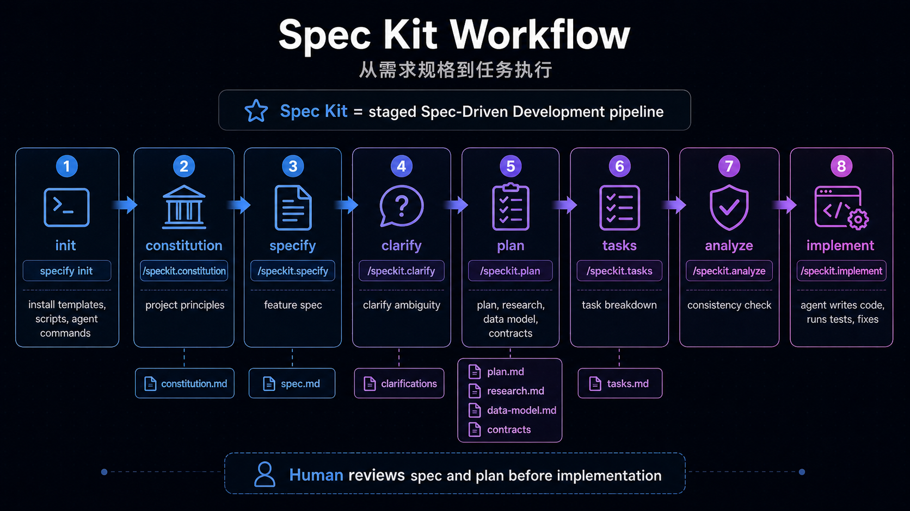
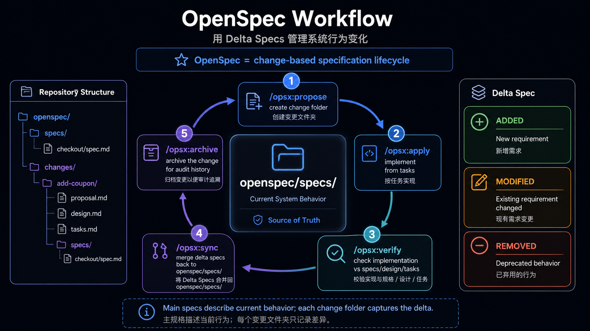
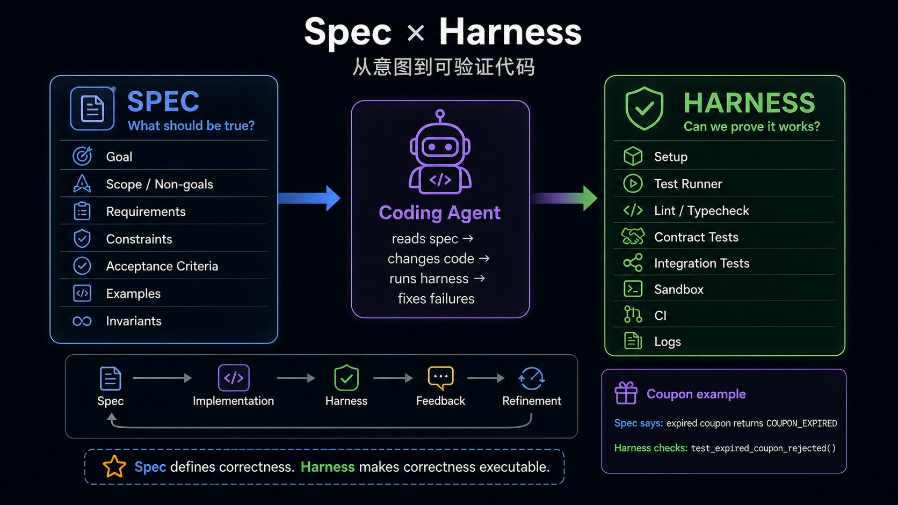
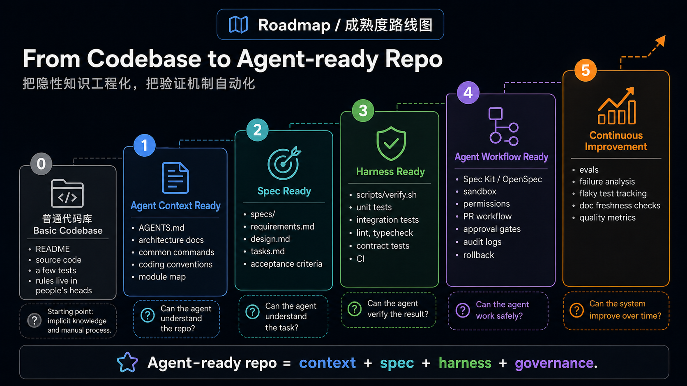

# Agent-Ready Engineering Infrastructure

面向 Coding Agent 的项目基础设施，不是把项目改造成一个 agent 产品，也不是在 README 里多写几句“请先跑测试”。

它回答的是一个更具体的问题：当 Cursor、Codex、Claude Code 这类 Coding IDE 或 Coding Agent 进入真实项目时，代码库本身要提供哪些工程接口，才能让 agent 读得懂、改得动、验得出、管得住，并且能从失败中持续变好。

本文的结论很短：

```text
Agent-ready repo
  = context
  + intent
  + execution
  + verification
  + governance
  + feedback
```


`spec` 和 `harness` 是核心模块，但不是全部。

- `spec` 主要解决 intent：这次任务到底要做什么、边界是什么、怎么算完成。
- `harness` 主要连接 execution、verification 和 feedback：代码怎样在受控环境里运行、怎样证明结果正确、失败信息怎样回到 agent 和团队手里。

下面的代码片段都来自真实开源项目。为了降低阅读负担，片段只保留和基础设施判断直接相关的行。

案例不是全量矩阵。只有当某个项目在某一层有代表性、可参考、或呈现出清晰工程取舍时，才整理进正文。

## 本文范围

本文只分析 **开发具体项目时给 Coding Agent 使用的基础设施**。如果某个开源项目本身就是 agent 产品，本文不会分析它的 agent loop、memory、tool calling、模型路由等运行时设计。只有当这些内容被转化成开发仓库时必须遵守的规则、验证入口、配置或治理机制时，才纳入讨论。

## 六层模型

| 层 | 解决的问题 | 常见产物 |
|---|---|---|
| Context | agent 如何理解项目和边界 | `AGENTS.md`、scoped guide、architecture map、coding rules |
| Intent | agent 如何理解本次任务 | spec、proposal、design、tasks、acceptance criteria |
| Execution | agent 在哪里、用什么权限执行 | setup、Makefile、Docker、devcontainer、MCP/tool config |
| Verification | agent 怎么证明改对了 | test、lint、typecheck、contract test、CI、eval harness |
| Governance | agent 的改动如何被限制和审计 | approval gate、CODEOWNERS、PR template、diff guard、rollback |
| Feedback | 失败和 review 如何回流 | failure artifacts、coverage、trajectory、benchmark、flaky tracking |

传统代码库大量依赖人类的组织记忆：哪些模块不能动、哪些测试 flaky、哪些命令只能在 CI 跑、哪些接口是 public contract。Coding Agent 不能稳定依赖这些隐性知识。Agent-ready infrastructure 的本质，是把这些知识做成仓库里的工程接口。

```text
把隐性知识显性化
把显性规则结构化
把结构化规则自动化
把自动化结果反馈给 agent
```

## 1. Context Layer

Context Layer 让 agent 知道这个项目是什么、该读哪里、哪些边界不能破坏。最小形态是根目录 `AGENTS.md`；成熟形态通常是 root guide 加 scoped guide。

### 代码证据：OpenClaw 的 `AGENTS.md` 是 agent 操作规程

`AGENTS.md` 不是普通 README 的重复。OpenClaw 的根文件直接告诉 agent：先读哪些局部规则、项目边界在哪里、哪些命令不能直接乱跑、哪些改动触发哪些 gate。

```md
Root rules only. Read scoped `AGENTS.md` before subtree work.

## Map
- Core TS: `src/`, `ui/`, `packages/`; plugins: `extensions/`;
  SDK: `src/plugin-sdk/*`; channels: `src/channels/*`.
- Scoped guides exist in: `extensions/`, `src/{plugin-sdk,channels,plugins,gateway}/`,
  `test/helpers*/`, `docs/`, `ui/`, `scripts/`.

## Commands
- Smart gate: `pnpm check:changed`; explain `pnpm changed:lanes --json`.
- Targeted tests: `pnpm test <path-or-filter> [vitest args...]`; never raw `vitest`.

## Gates
- Changed lanes:
  - core prod: core prod typecheck + core tests
  - public SDK/plugin contract: extension prod/test too
```

这就是 Context Layer 的核心价值：它不只是告诉 agent “项目怎么启动”，而是把仓库地图、局部规则入口、命令约束、owner 边界和验证路线压缩成可执行的工作上下文。

### 代码证据：Langfuse 把多工具规则收敛到 `.agents/`

Langfuse 不是为每个 Coding IDE 手写一份配置，而是从 `.agents/config.json` 生成 Claude、Codex、Cursor、MCP 等工具配置。

```js
const sourcePath = resolve(repoRoot, ".agents/config.json");
const config = JSON.parse(readFileSync(sourcePath, "utf8"));

const fileOutputs = [
  { path: resolve(repoRoot, ".claude/settings.json"), content: formatClaudeSettings() },
  { path: resolve(repoRoot, ".mcp.json"), content: formatSharedJsonConfig() },
  { path: resolve(repoRoot, ".codex/environments/environment.toml"), content: formatCodexEnvironmentToml() },
  { path: resolve(repoRoot, ".cursor/mcp.json"), content: formatSharedJsonConfig() },
  { path: resolve(repoRoot, ".cursor/environment.json"), content: formatCursorEnvironment() }
];
```

这段代码说明一个重要趋势：多 agent IDE 并存时，团队需要一个 canonical source，再投影到不同工具的读取格式里。LangGraph 的短 guide 也提醒我们：Context Layer 不追求长，而追求可导航。

一个合格的 Context Layer 应该让 agent 回答：

- 这个任务应该从哪个目录开始？
- 有没有更具体的 scoped guide？
- 哪些公共接口、依赖边界或架构边界不能破坏？
- 修改后应该跑什么命令？
- 什么情况必须让人类确认？

代表案例：

| 项目 | 案例 | 参考价值 |
|---|---|---|
| OpenClaw | 根 `AGENTS.md` + 多个 scoped `AGENTS.md` | 把大型仓库的 map、命令、gate、owner boundary 写成 agent 操作规程 |
| Dify | 根 `AGENTS.md` 路由到 `api/`、`web/`、`e2e/` 局部规则 | 多技术栈应用适合 root guide 只做分流，细节下沉到子域 |
| Langfuse | `.agents/AGENTS.md` 作为 canonical source，同步到多工具配置 | 多 agent IDE 并存时，避免 Claude/Codex/Cursor/MCP 配置漂移 |
| LangGraph | 极简 `AGENTS.md` | 证明 context 不是越长越好；边界清楚的库可以只保留高信号入口 |

## 2. Intent Layer

Intent Layer 让 agent 理解这次任务的目标、边界和验收标准。Context 是长期规则，Intent 是本次变更的任务契约。

| spec 需要表达 | 典型内容 |
|---|---|
| 要做什么 | goal、用户场景、功能范围 |
| 不做什么 | non-goals、排除项、兼容边界 |
| 怎么算完成 | acceptance criteria、scenario、example |
| 不能破坏什么 | public contract、权限、安全、性能 |
| 如何验证 | test、lint、typecheck、E2E、schema check |
| 不确定怎么办 | 待澄清问题、保守决策规则 |

### 代码证据：Spec Kit 把 intent 拆成阶段化 artifacts

Spec Kit 的重点不是“多一个 spec 文件”，而是把从原则到实现的路径拆成 agent 可执行的命令序列。

```text
/speckit.constitution  -> project principles
/speckit.specify       -> what and why
/speckit.plan          -> technical plan
/speckit.tasks         -> implementation tasks
/speckit.implement     -> execute tasks
```

它的 workflow 还把 spec 和 plan 放在人类 review gate 前面：

```yaml
inputs:
  spec:
    type: string
    prompt: "Describe what you want to build"

steps:
  - id: specify
    command: speckit.specify

  - id: review-spec
    type: gate
    options: [approve, reject]

  - id: plan
    command: speckit.plan

  - id: review-plan
    type: gate
    options: [approve, reject]

  - id: tasks
    command: speckit.tasks

  - id: implement
    command: speckit.implement
```



它的基础设施意义在于三点：

- 把项目原则沉淀为 `.specify/memory/constitution.md`，让后续 spec、plan、tasks 都受同一套原则约束。
- 把“写代码前要想清楚”变成 agent command，而不是靠人类临时提醒。
- 把 review 放在 spec 和 plan 阶段，避免 agent 已经写出大 diff 后才暴露方向错误。

### 代码证据：OpenSpec 把变更做成 delta lifecycle

OpenSpec 的路线不同：它更像长期维护的行为规格库。当前系统行为放在 `specs/`，本次变更放在 `changes/`，完成后 archive。

```text
openspec/
  specs/
    <current-system-behavior>/
  changes/
    <active-change>/
      proposal.md
      design.md
      tasks.md
      specs/
    archive/
      <completed-change>/
```



真实 change 里，`proposal.md` 先定义 why / what / non-goals：

```md
## What Changes

Add the first user-facing workspace setup flow:

openspec workspace setup
openspec workspace list
openspec workspace link /path/to/api
openspec workspace relink api /new/path/to/api
openspec workspace doctor

## Non-Goals

- No public `openspec workspace create` command in this first release.
- No agent launch or workspace open behavior.
- No apply, verify, archive, branch, or worktree behavior.
```

delta spec 再把行为变成 requirements 和 scenarios：

```md
## MODIFIED Requirements

### Requirement: Stable Workspace Name
OpenSpec SHALL use one kebab-case workspace name across workspace identity,
managed storage, and the local registry.

#### Scenario: Rejecting invalid workspace names
- WHEN OpenSpec accepts a workspace name
- THEN it SHALL require kebab-case names using lowercase letters, numbers,
  and single hyphen separators
```

`tasks.md` 则把 intent 落到可勾选的实现和验证任务：

```md
- [x] Implement `openspec workspace setup` as the only public creation path
- [x] Fail cleanly when non-interactive setup is missing a name or link
- [x] Run `openspec validate workspace-create-and-register-repos --strict`
- [x] Run targeted command tests for workspace setup/list/link/relink/doctor
```

Spec Kit 和 OpenSpec 的共性，是把人类意图变成 agent 可消费、可追踪、可审查的 artifacts；差异是一个偏阶段化 pipeline，一个偏 change / delta spec lifecycle。

代表案例：

| 项目 | 案例 | 参考价值 |
|---|---|---|
| Spec Kit | constitution / specify / plan / tasks / implement | 适合新项目或大 feature，把 intent 做成阶段化 artifact pipeline |
| OpenSpec | `specs/` source of truth + `changes/` delta spec + archive | 适合既有项目，把“这次改变什么”放进可审查的 change lifecycle |
| Dify | `api/AGENTS.md` 要求把 docstring/comment 当作 spec 读取和维护 | 把局部 invariants、edge cases、trade-offs 留在离代码最近的位置 |
| Langfuse | Public API contract 变更必须更新 Fern sources 和生成物 | intent 不只是需求文档，也包括 API contract 和 schema source of truth |

## 3. Execution Layer

Execution Layer 让 agent 在可复现、受控、有边界的环境里执行任务。它不只是“项目能跑起来”，还要减少环境猜测和危险副作用。

它确实会包含测试命令和执行流程，但不等于 Verification Layer。

| 问题 | 属于哪一层 | 例子 |
|---|---|---|
| 怎么安装依赖、启动服务、reset 数据、打开浏览器 | Execution | `e2e:install`、`e2e:middleware:up`、`e2e:reset` |
| 在什么环境里跑，能不能联网，secret 怎么处理 | Execution | Docker、sandbox、devcontainer、MCP/tool config |
| 这次改动必须跑哪些检查 | Verification | API 变更跑 API tests，migration 变更跑 migration check |
| 什么结果算通过，失败 artifact 在哪里 | Verification | required checks、coverage、E2E report、benchmark output |

同一个 test command 会横跨两层：Execution 定义“怎样把它跑起来”，Verification 定义“什么时候必须跑、怎样判断结果有效、失败如何回流”。

### 代码证据：Dify 把 E2E 执行入口脚本化

Dify 的 E2E package 没有只写一句“run e2e tests”。它把安装、启动中间件、reset、full run、headed run 都做成脚本入口。

```json
{
  "scripts": {
    "e2e": "tsx ./scripts/run-cucumber.ts",
    "e2e:full": "tsx ./scripts/run-cucumber.ts --full",
    "e2e:install": "playwright install --with-deps chromium",
    "e2e:middleware:up": "tsx ./scripts/setup.ts middleware-up",
    "e2e:middleware:down": "tsx ./scripts/setup.ts middleware-down",
    "e2e:reset": "tsx ./scripts/setup.ts reset"
  }
}
```

端到端测试往往依赖浏览器、后端、中间件、种子数据和 reset 顺序。把这些变成命令，比让 agent 从文档里猜流程可靠得多。

### 代码证据：OpenHands 把真实运行坑写进执行入口

OpenHands 的 `AGENTS.md` 不只是列命令，还把本地 sandbox 中会遇到的环境问题写出来。

```md
make build && make run FRONTEND_PORT=12000 FRONTEND_HOST=0.0.0.0 \
  BACKEND_HOST=0.0.0.0 &> /tmp/openhands-log.txt &

Local run troubleshooting notes:
- If the backend fails with `nc: command not found`, install `netcat-openbsd`.
- If local runtime startup fails with `duplicate session: test-session`,
  clear the stale tmux session.
- In this sandbox environment, an inherited `SESSION_API_KEY` can make
  `/api/v1/settings` return 401 in the browser. Unset it before `make run`.

IMPORTANT: Before making any changes to the codebase, ALWAYS run
`make install-pre-commit-hooks`.
```

这类内容很容易被人类当成“经验”，但对 agent 来说必须进入仓库。Execution Layer 的一个成熟信号，就是把真实环境的坑写成可执行前提。

### 代码证据：Aider benchmark 默认隔离执行

Aider 的 benchmark 会执行 LLM 生成的代码，所以它明确要求在 Docker 里跑。

```md
The benchmark is intended to be run inside a docker container.
This is because the benchmarking harness will be taking code written by an LLM
and executing it without any human review or supervision.

./benchmark/docker_build.sh
./benchmark/docker.sh
./benchmark/benchmark.py a-helpful-name-for-this-run --model gpt-3.5-turbo
```

这说明 Execution Layer 还包含安全边界。只要 agent 或模型输出会被执行，sandbox/Docker 就不是锦上添花，而是基础设施。

落地判断：

- 小项目至少需要一个可靠的 setup/test/build 入口。
- 中大型项目需要区分 local quick check、PR check、CI-only check。
- 会执行模型生成代码的场景，应该默认进入 Docker 或 sandbox。
- MCP/tool 配置不要散落在多个 IDE 专属文件里长期手工维护。

代表案例：

| 项目 | 案例 | 参考价值 |
|---|---|---|
| Dify | E2E package scripts 管理 install、middleware up/down、reset、full run | 把复杂端到端执行流程脚本化，减少 agent 猜测 |
| OpenHands | run/build/pre-commit + sandbox troubleshooting | 把真实开发环境问题显性化，尤其适合复杂本地应用 |
| Aider | benchmark 必须在 Docker 中执行 | 执行 LLM 生成代码时，sandbox 是安全边界 |
| Langfuse | `scripts/codex/setup.sh`、Playwright install、MCP/Codex/Cursor environment 生成 | Execution 不只是 shell 命令，也包括 agent tool 和环境 bootstrap |

## 4. Verification Layer

Verification Layer 让 agent 做完后，项目能自动判断它是否真的做对。

Spec 和 harness 的关系可以用一句话概括：

> Spec defines correctness. Harness makes correctness executable.



### 代码证据：Dify 用 path filter 选择要跑的 CI

Dify 的主 CI 先判断哪些区域发生变化，再触发 API、web、E2E、vector database、migration 等不同 workflow。

```yaml
check-changes:
  outputs:
    api-changed: ${{ steps.changes.outputs.api }}
    e2e-changed: ${{ steps.changes.outputs.e2e }}
    web-changed: ${{ steps.changes.outputs.web }}
    vdb-changed: ${{ steps.changes.outputs.vdb }}
    migration-changed: ${{ steps.changes.outputs.migration }}
  steps:
    - uses: dorny/paths-filter@...
      with:
        filters: |
          api:
            - 'api/**'
          web:
            - 'web/**'
            - 'packages/**'
          e2e:
            - 'api/**'
            - 'e2e/**'
            - 'web/**'
          migration:
            - 'api/migrations/**'
```

这不是产品逻辑，而是给 agent 的 verification planner：改了什么区域，就应该跑什么检查。大型项目不能要求 agent 每次盲跑全量，也不能让它漏掉受影响区域。

### 代码证据：OpenClaw 把 changed gate 写成项目代码

OpenClaw 没有只靠 CI YAML。它把路径分类、影响范围和检查原因写进仓库脚本。

```js
const DOCS_PATH_RE = /^(?:docs\/|README\.md$|AGENTS\.md$|.*\.mdx?$)/u;
const EXTENSION_PATH_RE = /^extensions\/[^/]+(?:\/|$)/u;
const CORE_PATH_RE = /^(?:src\/|ui\/|packages\/)/u;
const PUBLIC_EXTENSION_CONTRACT_RE =
  /^(?:src\/plugin-sdk\/|src\/plugins\/contracts\/|src\/channels\/plugins\/)/u;

if (PUBLIC_EXTENSION_CONTRACT_RE.test(changedPath)) {
  lanes.core = true;
  lanes.coreTests = true;
  lanes.extensions = true;
  lanes.extensionTests = true;
  reasons.push(`${changedPath}: public core/plugin contract affects extensions`);
}
```

这段代码比自然语言规则更有力量：它明确告诉 agent，修改 public plugin contract 时，不能只跑 core tests，还要跑 extension 相关检查。

### 代码证据：Hermes Agent 用 test runner 消除本地和 CI 漂移

Hermes Agent 不建议直接跑 `pytest`，而是提供 canonical test runner，固定环境、清理 credential-shaped env vars、固定 worker 数。

```bash
# inside an env-var loop
case "$name" in
  *_API_KEY|*_TOKEN|*_SECRET|*_PASSWORD|*_CREDENTIALS|GH_TOKEN|GITHUB_TOKEN)
    unset "$name"
    ;;
esac

export TZ=UTC
export LANG=C.UTF-8
export PYTHONHASHSEED=0
WORKERS="${HERMES_TEST_WORKERS:-4}"

exec "$PYTHON" -m pytest \
  -o "addopts=" \
  -n "$WORKERS" \
  --ignore=tests/integration \
  --ignore=tests/e2e \
  "${ARGS[@]}"
```

这对 Coding Agent 尤其重要。Agent 并不知道开发机上有哪些 API key、locale、CPU 数量和 shell 状态。一个 hermetic runner 可以把“我这里过了”变成更接近 CI 的信号。

Verification Layer 的核心原则：

```text
spec 中重要的规则，最好都能在 harness 里找到对应检查。
```

如果 spec 说“public API schema 不变”，harness 至少要有 contract test 或 schema diff。  
如果 spec 说“migration 可回滚”，harness 至少要有 migration dry-run 或 rollback check。  
如果 spec 说“不能引入跨 owner 依赖”，harness 至少要有 import boundary 或 dependency ownership check。

代表案例：

| 项目 | 案例 | 参考价值 |
|---|---|---|
| Dify | path-filter CI + stable required checks | 大型应用用 changed surface 决定 API/web/E2E/migration 检查 |
| OpenClaw | `changed-lanes.mjs` 把路径影响范围代码化 | verification planner 不靠人类记忆，尤其适合 public contract 影响扩散 |
| Hermes Agent | canonical test runner 清理 env、固定 worker、排除 integration/e2e | 消除本地和 CI 漂移，让 agent 的测试结论更可信 |
| Ragas | Makefile 聚合 `format`、`type`、`check`、`run-ci`、`benchmarks` | 通用库可以用少量命令提供清晰验证入口 |
| Aider / SWE-agent | benchmark/eval harness 记录 pass rate、cost、trajectory | 对 agent 能力本身的验证需要可复现评测，而不只是单次测试 |

## 5. Governance Layer

Governance Layer 让 agent 的改动可限制、可审计、可批准、可回滚。这是区分“能让 agent 写代码”和“敢让 agent 进入真实项目”的关键。

### 代码证据：OpenHands 给复杂 PR 一个临时证据目录

OpenHands 允许复杂 PR 使用 `.pr/` 保存设计 rationale、调试日志、E2E 结果等临时资料，但不希望这些内容合入主分支。

```yaml
if [ -d ".pr" ]; then
  git config user.name "allhands-bot"
  git rm -rf .pr/
  git commit -m "chore: Remove PR-only artifacts [automated]"
  git push
fi
```

这个设计的价值是：治理不只是禁止 agent 做什么，也可以给 agent 一个临时工作空间，让过程证据可见，但不污染长期代码库。OpenClaw 的 `AGENTS.md` 也体现了同一原则：把 broad gate、Testbox、owner review、release approval、PR verification 等事项写进 agent 必须读取的操作规程。

### 代码证据：Langfuse 把 PR 规范变成检查

Langfuse 的 PR template 要求 Conventional Commits 标题、自审、测试和文档检查；workflow 再自动验证标题。

```yaml
name: "Validate PR Title"

on:
  pull_request:
    types: [opened, edited, synchronize, reopened]

jobs:
  validate-pr-title:
    steps:
      - name: Validate PR title follows conventional commits
        uses: amannn/action-semantic-pull-request@...
        with:
          types: |
            feat
            fix
            docs
            refactor
            test
            security
```

这类规则对 agent 很重要：它把“PR 应该怎样进入协作流程”变成机器可检查的治理边界，而不是只靠 reviewer 口头提醒。

Governance Layer 应该明确：

- 哪些文件或目录可以改。
- 哪些 public contract 需要 owner review。
- 哪些命令可以本地跑，哪些只能 CI 或远端跑。
- 哪些检查失败必须修，哪些可以解释。
- 哪些临时证据可以进入 PR，哪些不能合入 main。

代表案例：

| 项目 | 案例 | 参考价值 |
|---|---|---|
| OpenHands | `.pr/` 临时 artifacts + approval 后自动清理 | 给复杂 agent PR 留证据空间，同时保持 main 干净 |
| OpenClaw | owner review、Testbox、release approval、PR verification 写进 `AGENTS.md` | 高风险仓库需要明确哪些动作必须人类批准 |
| Langfuse | PR template + semantic PR title workflow + CodeQL/Snyk | 把 review hygiene 和安全检查变成自动 gate |
| Dify | semantic PR title + 分层 CI required checks | 大型应用用稳定检查名和 PR 规则维持 merge gate |

## 6. Feedback Layer

Feedback Layer 让失败、review 和质量信号回流，让下一次 agent 工作更好。这一层目前最不成熟，但已经能看到几个方向：

### 代码证据：失败不是终端输出，而是 artifact

Dify 的 E2E workflow 会上传 logs，SWE-agent 的 CI 会上传 trajectories。它们的共同点是：失败结果不是留在一次终端输出里，而是变成可下载、可复盘、可交给 agent 继续分析的材料。

```yaml
# Dify web-e2e
- name: Upload E2E logs
  uses: actions/upload-artifact@...
  with:
    name: e2e-logs
    path: e2e/.logs

# SWE-agent pytest
- name: Upload logs & trajectories
  uses: actions/upload-artifact@v7
  if: always()
  with:
    name: trajectories-py${{ matrix.python-version }}
    path: trajectories/runner/
```

Aider 的 benchmark report 则把一次 eval 的关键上下文也记录下来：

```yaml
model: claude-3.5-sonnet
edit_format: diff
commit_hash: 35f21b5
pass_rate_1: 57.1
percent_cases_well_formed: 99.2
syntax_errors: 1
test_timeouts: 1
total_cost: 3.6346
```

Feedback Layer 的价值有三层：

1. 当前任务失败时，agent 可以读具体 artifact，而不是重新猜。
2. 人类 review 时，可以看到 agent 做过哪些验证，不只看自然语言承诺。
3. 长期看，团队可以把重复失败写回 Context、Intent 或 Verification Layer。

代表案例：

| 项目 | 案例 | 参考价值 |
|---|---|---|
| Dify | API/web/E2E coverage 和 E2E logs artifact | 失败按子系统回流，便于 agent 定位下一步 |
| SWE-agent | trajectories artifact | 不只看结果，还能复盘 agent 行为路径 |
| Aider | benchmark YAML 记录 model、commit、pass rate、cost、错误类型 | eval 结果可比较、可复现 |
| OpenClaw | changed lane reason、timing、性能记录 | agent 能知道为什么跑某些检查、哪些检查慢 |
| Langfuse | `agents:check` 检查多工具配置漂移 | agent 配置本身也可以进入反馈闭环 |

## 横向观察：共性和分歧

下面的观察只看这些项目如何让 Coding Agent 参与开发，不评价它们的产品形态。

| 项目 | 看代码能看到什么 | 落地启发 |
|---|---|---|
| OpenClaw | `AGENTS.md`、scoped guide、changed lane 脚本、gate 规则 | 大型仓库需要把 agent 操作规程和 verification planner 代码化 |
| Langfuse | `.agents/` canonical source、MCP/Cursor/Codex/Claude 配置生成 | 多 agent IDE 并存时，需要共享源文件，避免规则漂移 |
| Dify | root/scoped `AGENTS.md`、E2E scripts、path-filter CI | 大型应用适合把上下文和检查拆到子域 |
| OpenHands | setup troubleshooting、pre-commit、`.pr/` cleanup workflow | 复杂 PR 需要过程证据，但主分支要保持干净 |
| Hermes Agent | hermetic test runner、credential env cleanup、固定 worker | harness 要主动消除本地和 CI 漂移 |
| LangGraph | 极简 agent guide、统一 make 命令 | 项目简单时，短 guide 也可以有效 |
| Spec Kit | specify / plan / tasks / implement + review gate | Intent Layer 可以被做成阶段化 pipeline |
| OpenSpec | `specs/` + `changes/` + archive | 既有项目适合用 delta spec 维护行为变化 |
| Aider | Docker benchmark harness、pass rate/cost/error report | eval harness 要隔离执行并记录可复现指标 |
| SWE-agent | Docker sandbox、batch mode、trajectory artifact | agent 评测需要实例、环境、patch、评价闭环 |
| Ragas | Makefile checks、CI matrix、benchmarks | 通用库可以用清晰命令提供稳定 harness |

已经形成的共性：

- Context file 正在成为标配，但格式仍然分裂。
- Scoped guide 比单个巨型根文件更可维护。
- Verification 是最成熟的共识，差异在于是否有统一入口和 changed gate。
- Spec workflow 仍在分化，但“先产生可审查 artifact，再写代码”方向明确。
- Governance 在高风险项目里越来越具体。
- Feedback Layer 还早，但 benchmark、trajectory、artifact、config drift check 已经出现。

主要分歧：

- 有的项目选择极简 guide，有的选择详尽操作规程。
- 有的项目把 spec 作为长期 source of truth，有的只在 PR 或 feature 阶段短期保留。
- 有的项目追求本地复现 CI，有的明确把重型检查放到远端或 CI-only。
- 有的项目靠 Makefile 聚合检查，有的写专门的 changed-gate 脚本。
- 有的项目让 agent 配置分散在工具目录，有的用 `.agents/` 做 canonical source。

## 从普通代码库到 Agent-ready Repo

一个普通项目不需要一开始就引入完整的 Spec Kit、OpenSpec、eval harness 和复杂 CI gate。更实际的路线是分级成熟。



| Level | 目标 | 最小动作 |
|---|---|---|
| 0. 普通代码库 | README、源码和一些测试，但规则主要在人的脑子里 | 暂无，agent 只能搜索和猜 |
| 1. Agent Context Ready | agent 能知道项目结构、命令和边界 | 写根 `AGENTS.md`，大项目补 scoped guide |
| 2. Spec Ready | agent 能理解本次变更的任务契约 | 小改动写轻量 spec；中型 feature 写 requirements/design/tasks；既有系统可试 OpenSpec，大 feature 可试 Spec Kit |
| 3. Harness Ready | agent 能通过统一入口验证改动 | 提供 `./scripts/verify.sh`、`make check` 或 `pnpm check`，并说明 quick/PR/CI-only 检查 |
| 4. Agent Workflow Ready | 六层连成日常工作流 | 明确读取 guide、生成 spec、修改、验证、提交证据、进入 review 的顺序 |
| 5. Continuous Agent Improvement | 失败和 review 持续反哺基础设施 | 统计失败模式，把重复 review comment 写回 guide，把漏测写回 spec 或 harness |

Level 4 的工作流可以非常朴素：

```text
读取 AGENTS.md
  -> 读取 scoped guide
  -> 读取或生成 spec / tasks
  -> 按任务修改
  -> 运行 harness
  -> 提交验证证据
  -> 进入 PR review / approval gate
```

## 对 Agent Grove 的启发

这篇文章不应该只作为“第一篇内容”发布出去，更应该反过来成为 Agent Grove 自身建设的路线图。

我们已经有：

- `AGENTS.md`：项目协作规则入口。
- `README.md` / `README.zh-CN.md`：项目定位和知识框架草案。
- VitePress 文档站和 GitHub Pages workflow。
- 本地 `external/` 作为研究材料，但不进入正式内容目录。

接下来可以按三条线推进。

第一条线是建设 Agent Grove 这个仓库本身。参考 OpenClaw、Dify、Langfuse 的做法，我们不急着创建空的 `specs/`、`evals/`、`harnesses/`、`case-studies/` 目录，而是先让真实工作推动基础设施出现：

- Context：继续维护 `AGENTS.md`，当文档、研究、代码、Arbor 开始分化时，再补 scoped guide。
- Intent：每个正式研究主题先有轻量任务契约，说明问题、范围、证据标准和交付形态。
- Execution：先沉淀文档站构建、图片资产处理、引用检查等真实命令。
- Verification：把 `npm run docs:build` 作为当前最小 harness；后续再补链接检查、图片存在性检查、引用格式检查。
- Governance：明确 external 研究材料不进入正式内容目录，未成熟内容不包装成正式文章。
- Feedback：把 review 中反复出现的问题写回写作规则或文章模板，而不是只停留在对话里。

第二条线是 examples。examples 值得做，但不应该为了“看起来完整”而做。更合适的标准是：当一个概念只靠文章讲不清，或者需要可运行证据时，再做最小 example。比如：

- 一个最小 `AGENTS.md` + scoped guide 示例，用来演示 Context Layer。
- 一个轻量 spec + verify script 示例，用来演示 Intent 到 Verification 的连接。
- 一个失败 artifact 回流示例，用来演示 Feedback Layer。

这些 examples 应该一例一概念，服务于文章结论，不变成另一个教程仓库。

第三条线是 Arbor。Arbor 不是为了写文章、做调研而存在的辅助工具，而是 Agent Grove 要真正迭代起来的轻量学习版 OpenClaw：一个用来实践 agent 工程基础设施的代码型 Agent 项目。

Arbor 可以从小开始，但它应该尽早进入真实开发形态：

- 有自己的代码目录、模块边界和 agent-facing guide。
- 有轻量 spec，描述每次能力增量要解决什么问题、不做什么、如何验收。
- 有 execution harness，能在受控环境里运行最小 agent loop、tool 调用和任务流程。
- 有 verification harness，能验证一次任务是否按 spec 完成，而不只看自然语言输出。
- 有 governance 边界，明确哪些文件、命令、tool、外部副作用需要限制或人工批准。
- 有 feedback artifact，记录失败轨迹、测试结果、成本、延迟和可复盘的执行过程。

examples 仍然有价值，但它们更像 Arbor 之外的单点实验：当某个概念暂时不适合直接放进 Arbor，或者需要一个非常小的可运行切片时，再做 example。长期看，真正承载多层 infrastructure 的应该是 Arbor，而不是一堆孤立 demos。

因此，Agent Grove 的主线不应该变成 Spec Kit / OpenSpec / Harness 的教程合集。外部资料和官网教程已经很详细，我们更应该把它们作为案例和证据，吸收进自己的工程判断。后续文章也不写“某项目介绍”，而是写“某项目在某个 Agent 工程问题上的实现和取舍”，并最终反哺 Arbor 这个真实系统。

这也符合本文的核心判断：agent-ready 不是一次性堆满目录，而是把真实协作中反复需要的上下文、意图、执行、验证、治理和反馈逐步工程化。

## 参考资料

- [AGENTS.md](https://agents.md/)
- [OpenAI Codex AGENTS.md guide](https://developers.openai.com/codex/guides/agents-md)
- [OpenAI: Harness engineering for reliable agents](https://openai.com/index/harness-engineering/)
- [GitHub Spec Kit README](https://github.com/github/spec-kit/blob/1994bd766ea2a3b1d9d87dcec18abc9410f39834/README.md)
- [Spec Kit workflow definition](https://github.com/github/spec-kit/blob/1994bd766ea2a3b1d9d87dcec18abc9410f39834/workflows/speckit/workflow.yml)
- [OpenSpec Getting Started](https://github.com/Fission-AI/OpenSpec/blob/7c3acccaf7d01006e3aac2194a2a1967e4d66984/docs/getting-started.md)
- [OpenSpec Workflows](https://github.com/Fission-AI/OpenSpec/blob/7c3acccaf7d01006e3aac2194a2a1967e4d66984/docs/workflows.md)
- [OpenSpec workspace change example](https://github.com/Fission-AI/OpenSpec/tree/7c3acccaf7d01006e3aac2194a2a1967e4d66984/openspec/changes/workspace-create-and-register-repos)
- [OpenClaw AGENTS.md](https://github.com/openclaw/openclaw/blob/e8d0cf75ea0e6c0db5a1468cb0715746fa3ad75e/AGENTS.md)
- [OpenClaw changed lanes](https://github.com/openclaw/openclaw/blob/e8d0cf75ea0e6c0db5a1468cb0715746fa3ad75e/scripts/changed-lanes.mjs)
- [Langfuse agent guide](https://github.com/langfuse/langfuse/blob/0256db00672babdeac527221186429ef258848ca/.agents/AGENTS.md)
- [Langfuse agent config sync](https://github.com/langfuse/langfuse/blob/0256db00672babdeac527221186429ef258848ca/scripts/agents/sync-agent-shims.mjs)
- [LangGraph AGENTS.md](https://github.com/langchain-ai/langgraph/blob/a0c4bdc3cb88e371a0fee00b6479509e9c9a8a72/AGENTS.md)
- [Dify AGENTS.md](https://github.com/langgenius/dify/blob/cd9daef564369b3926ce7fed242a1feb5c4a451f/AGENTS.md)
- [Dify API Agent Guide](https://github.com/langgenius/dify/blob/cd9daef564369b3926ce7fed242a1feb5c4a451f/api/AGENTS.md)
- [Dify E2E Agent Guide](https://github.com/langgenius/dify/blob/cd9daef564369b3926ce7fed242a1feb5c4a451f/e2e/AGENTS.md)
- [Dify E2E package scripts](https://github.com/langgenius/dify/blob/cd9daef564369b3926ce7fed242a1feb5c4a451f/e2e/package.json)
- [Dify main CI workflow](https://github.com/langgenius/dify/blob/cd9daef564369b3926ce7fed242a1feb5c4a451f/.github/workflows/main-ci.yml)
- [Dify Web E2E workflow](https://github.com/langgenius/dify/blob/cd9daef564369b3926ce7fed242a1feb5c4a451f/.github/workflows/web-e2e.yml)
- [Dify semantic PR workflow](https://github.com/langgenius/dify/blob/cd9daef564369b3926ce7fed242a1feb5c4a451f/.github/workflows/semantic-pull-request.yml)
- [OpenHands AGENTS.md](https://github.com/OpenHands/OpenHands/blob/d3864d9992c4a7503b32e9fbc1fba8c4bf2bdf92/AGENTS.md)
- [OpenHands PR artifacts workflow](https://github.com/OpenHands/OpenHands/blob/d3864d9992c4a7503b32e9fbc1fba8c4bf2bdf92/.github/workflows/pr-artifacts.yml)
- [Hermes Agent test runner](https://github.com/NousResearch/hermes-agent/blob/8163d371922768c32f43eb6036d7d36e56775605/scripts/run_tests.sh)
- [Aider benchmark harness](https://github.com/Aider-AI/aider/blob/3ec8ec5a7d695b08a6c24fe6c0c235c8f87df9af/benchmark/README.md)
- [SWE-agent batch mode](https://github.com/SWE-agent/SWE-agent/blob/0f4f3bba990e01ca8460b9963abdcd89e38042f2/docs/usage/batch_mode.md)
- [SWE-agent pytest workflow](https://github.com/SWE-agent/SWE-agent/blob/0f4f3bba990e01ca8460b9963abdcd89e38042f2/.github/workflows/pytest.yaml)
- [Langfuse package scripts](https://github.com/langfuse/langfuse/blob/0256db00672babdeac527221186429ef258848ca/package.json)
- [Langfuse PR title workflow](https://github.com/langfuse/langfuse/blob/0256db00672babdeac527221186429ef258848ca/.github/workflows/validate-pr-title.yml)
- [Langfuse PR template](https://github.com/langfuse/langfuse/blob/0256db00672babdeac527221186429ef258848ca/.github/PULL_REQUEST_TEMPLATE.md)
- [Langfuse CodeQL workflow](https://github.com/langfuse/langfuse/blob/0256db00672babdeac527221186429ef258848ca/.github/workflows/codeql.yml)
- [Langfuse Snyk Web workflow](https://github.com/langfuse/langfuse/blob/0256db00672babdeac527221186429ef258848ca/.github/workflows/snyk-web.yml)
- [Ragas Makefile](https://github.com/explodinggradients/ragas/blob/298b68274234c060deacab3cf5fb52aa3a20e885/Makefile)
